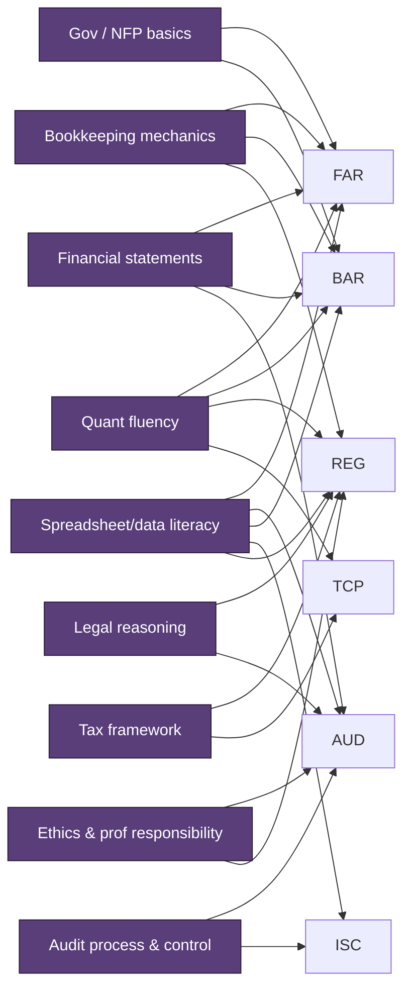
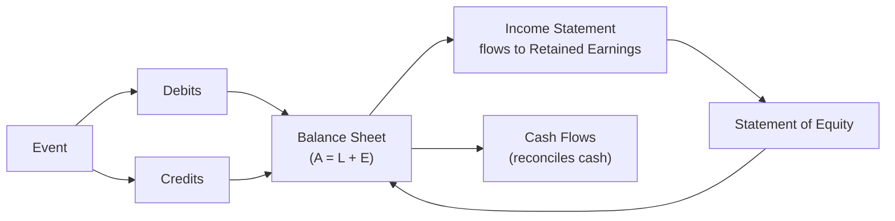

# Foundations — The Platform Before Section Study

The blueprints quietly **assume** you already have a platform of skills. When that platform is solid,
section study is mostly learning new rules on top of mechanics you already own. When it's weak, every
section feels slow and brittle because you're relearning bookkeeping *while* learning audit, tax, or
analysis. **Fix the foundation first — it pays off in all four sections.**

How to use this page: self-rate each foundation **Red / Yellow / Green**. Any Red gets repaired before
heavy review of the sections that depend on it (see the "Sections affected" column).

---

## The prerequisite checklist

| Foundation | Why it matters | Sections most affected | Minimum working standard | Self-rate |
|---|---|---|---|---|
| **Bookkeeping mechanics** | Journal entries, trial balances, ledgers, rollforwards, reconciling items, normal balances. The literal grammar of the exam. | FAR, BAR, REG/TCP basis | You can explain **every debit and credit in plain English** and build a rollforward unprompted. | ⬜ |
| **Financial statements** | Statement relationships, OCI, equity rollforward, cash-flow logic (direct/indirect), consolidations. | FAR, BAR, AUD | You can move from a transaction to its **statement impact** quickly, across all 5 statements + notes. | ⬜ |
| **Governmental & NFP basics** | FAR tests foundational GASB and NFP; BAR expands into full government-wide + fund reconciliations. | FAR, BAR | You know the statement names, **fund categories**, donor-restriction logic, and fund-to-government-wide reconciliation idea. | ⬜ |
| **Audit process & internal control** | Assertions, risk assessment, evidence, tests of controls vs. details, COSO, ITGCs. | AUD, ISC | You can map a process, **identify risks**, and state what evidence would address each. | ⬜ |
| **Tax framework** | Gross income → taxable income, basis, entity taxation, book-to-tax, owner-level consequences. | REG, TCP | You can explain **why** a transaction is taxable, deferred, excluded, capitalized, or separately stated. | ⬜ |
| **Legal reasoning** | Read fact patterns for *legally operative* facts; separate rule from exception. | REG, AUD | You can spot the **triggering fact**, not just the topic label, and name the controlling rule. | ⬜ |
| **Quantitative fluency** | Ratio math, algebra, percentages, cost formulas, time-value concepts, estimated-tax math. | FAR, BAR, REG/TCP | You perform routine calcs **without spreadsheet dependence**, under time pressure. | ⬜ |
| **Spreadsheet & data literacy** | Filters, sorting, basic formulas, rollforwards, simple query logic, clean-data habits. | FAR, AUD, BAR, ISC, REG | You can **validate** a schedule, not just read one; you trust-but-verify source data. | ⬜ |
| **Ethics & professional responsibility** | Code of Conduct, independence, Circular 230, confidentiality, privilege. | AUD, REG | You identify **which authority governs** the fact pattern *before* answering. | ⬜ |

---

## How the foundations feed the sections



---

## The single most important foundation: the accounting equation in motion

Almost everything testable reduces to keeping this identity true while a business event flows through it:

```
Assets = Liabilities + Equity      (and Equity changes via Revenues − Expenses ± OCI − Distributions)
```



If you can take *any* transaction and confidently say which accounts move, in which direction, and where
they land on the statements, you have the core skill FAR/BAR reward, the starting point REG/TCP adjust from
(book-to-tax), and the thing AUD asks you to verify.

---

## A fast diagnostic (try these cold)

If any of these feel slow, that foundation is **Yellow/Red**:

1. **Bookkeeping:** Record the purchase of equipment for $50k cash + $50k note; then one month of
   straight-line depreciation (10-yr life, no salvage). What's the rollforward of accumulated depreciation?
2. **Statements:** Net income is $200k; depreciation $30k; A/R rose $15k; A/P rose $10k. Operating cash
   flow (indirect)?
3. **Gov/NFP:** Name the government-wide statements vs. the fund statements, and one reason they reconcile.
4. **Audit:** For the *existence* assertion on inventory, what's a strong test of details?
5. **Tax:** Book depreciation is $30k, MACRS tax depreciation is $45k. Permanent or temporary difference?
   Which way does it move taxable income vs. book income this year?
6. **Legal:** In a contract dispute, what's the difference between a condition and a warranty, and why does
   it change the remedy?
7. **Quant:** Quick — current ratio if current assets $300k, current liabilities $120k? Inventory turnover
   if COGS $600k, average inventory $150k?
8. **Data:** Given a 12-row depreciation schedule, how would you *check* it foots and ties to the GL?
9. **Ethics:** A nonissuer review client asks you to also bookkeep. Which independence framework governs,
   and what's the threat?

Answers and drill sets belong in your review course; use this only to find your Red zones.

---

## Repair plan for Red foundations

| Red foundation | Fastest repair |
|---|---|
| Bookkeeping / statements | A focused pass through an **Intermediate Accounting** text (Kieso or Spiceland), chapters 1–5 + statement of cash flows; do 50 journal-entry reps. |
| Gov / NFP | Granof, *Government and Not-for-Profit Accounting*, intro + fund chapters. |
| Audit process / control | Arens, *Auditing and Assurance Services*, risk + internal control chapters; learn COSO's 5 components. |
| Tax framework | South-Western Federal Taxation (individual + entities intro); build a book-to-tax (Schedule M-1) worksheet from scratch. |
| Quant / data | Drill ratio formulas to instant recall; do a spreadsheet rollforward + foot/tie exercise. |
| Ethics | Read the **AICPA Code of Professional Conduct** conceptual framework + independence rules; skim **Circular 230** Subpart B. |

Full resource links: [`../resources/01-resource-stack.md`](../resources/01-resource-stack.md).

> **Rule of thumb:** budget **20–60 extra hours** up front if two or more foundations are Red. It is far
> cheaper than failing a section and rebuilding under time pressure.
