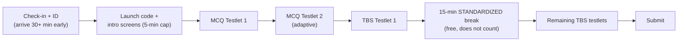
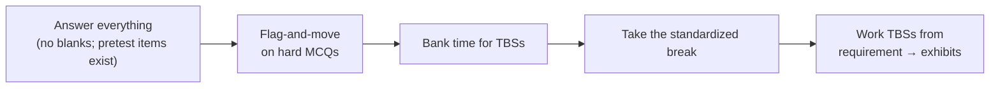

# Exam-Day Logistics

Test-center rules, timing, and scoring mechanics. Built from the NASBA Candidate Guide and current
score/scheduling info. **Verify current rules** against the live Candidate Guide before your sit — details
change.

---

## 1. The appointment

- Each section is **4 hours** of testing. The Prometric appointment is longer (~**4.5 hours**) to cover
  login, a survey, and the standardized break.
- A **15-minute standardized break** is offered **after the first TBS testlet** and **does not** count
  against your testing time. **Take it** — it's free recovery time.
- **All other breaks** are optional and the **clock keeps running.**

---

## 2. Test-center checklist

| Step | Rule | Why it matters |
|---|---|---|
| **Schedule early** | NASBA recommends scheduling **≥ 45 days** ahead; accommodations should be arranged **≥ 10 days** ahead | Prometric availability is the difference between an efficient and a broken timeline |
| **Bring exact documentation** | Correct **NTS** + required **identification** (name must match) | A mismatch can cost your seat and fees |
| **Arrive early** | Be there **≥ 30 minutes** before the appointment | Late arrival can mean forfeiture |
| **Respect the intro screens** | Introductory screens run under a **5-minute cap** after launch-code entry | Exceeding it can terminate the session and produce a **0** |
| **Use the standardized break well** | The 15-min break after the first TBS testlet is free time | Wasting it is a self-inflicted mistake |
| **Treat other breaks as timed** | Any other break counts against your exam time | Poor break discipline = preventable time pressure |
| **No electronics on break** | Personal devices are prohibited while actively testing | This is a **compliance** issue, not a suggestion — violations can end the exam |
| **Leave prohibited items outside** | Personal calculators, notes, paper, phones, etc. are not allowed | Security violations can end the exam |

---

## 3. Timing strategy inside the section

- **Budget by item weight.** With MCQ/TBS each worth ~50% (ISC 60/40), give the testlets time proportional
  to their scoring weight, not their item count.
- **Average MCQ pace ~1.25–1.5 min** so you bank time for TBSs (which take far longer).
- **Don't get stuck.** Flag-and-move on a hard MCQ; the **second MCQ testlet adapts** to your first, so
  steady accuracy matters more than agonizing over one item.
- **TBSs reward calm document work.** Read the requirement first, then mine the exhibits. Use the
  authoritative-literature search in research TBSs rather than recalling from memory.
- **Take the free 15-minute break** to reset before the TBS grind.

---

## 4. Scoring mechanics (recap)

- **0–99 scale; pass = 75.** Not percent-correct, not curved (item-response-theory scaling).
- **Answer every item** — unscored **pretest** questions are mixed in and you can't tell which.
- Advisory scores are released per the **AICPA score-release schedule**; routing is via **NASBA** or, in
  some jurisdictions, directly by the board.
- A failing score yields a **Candidate Performance Report** by content area & item type — your remediation
  map. See [`../study-plan/04-assessment-remediation.md`](../study-plan/04-assessment-remediation.md).

---

## 5. Credit window & jurisdiction notes (⚠️ verify)

- The score-credit window may be **18 months** (older Candidate Guide language) or **30 months from score
  release** (NASBA's amended UAA Model Rule, adopted by many jurisdictions). **It is jurisdiction-specific.**
- Education eligibility, NTS validity, and score-report mechanics also vary by board.
- **Confirm with your state board and NASBA jurisdiction pages** before filing or counting your window.

Full architecture & scheduling detail: [`../roadmap/02-exam-architecture.md`](../roadmap/02-exam-architecture.md).

---

## 6. The week-of and day-of checklist

**Week of:**
- [ ] NTS valid and matches the section booked
- [ ] ID checked (name match, not expired)
- [ ] Prometric location, route, and parking confirmed
- [ ] Two mocks at/above target (don't sit on a failing trajectory)

**Day of:**
- [ ] Arrive **30+ minutes early**
- [ ] Prohibited items left in the car/locker
- [ ] Plan to **take the standardized break**
- [ ] First task in the room: a quick mental dump of key formulas/decision rules onto the provided scratch material
