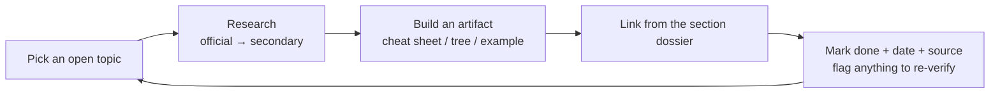

# Research Log — Deepening Each Competency Area

This repo's section dossiers are the **research-backed foundation**. This log is the **living tracker** for
the next phase: pushing each area from "covered" to **mastered**, one verified topic at a time. Update it as
you research, build artifacts, and confirm against the official blueprint.

---

## How to use this log

1. Pick an area from the matrix below with an open `[ ]`.
2. Research it against **official authority first** (2026 Blueprint, FASB/GASB/PCAOB/IRC/NIST), then trusted
   secondary sources.
3. Produce a **concrete artifact** (a cheat sheet, decision tree, worked example, or template) and link it
   from the relevant section dossier's "Deeper-research TODO."
4. Mark it done with a date and source, and note anything to **verify** later.



---

## Coverage status (Phase 1 = this build)

| Area | Foundation dossier | Blueprint weights captured | Connections mapped | Deep artifacts built |
|---|---|---|---|---|
| FAR | ✅ [`../sections/core-FAR.md`](../sections/core-FAR.md) | ✅ | ✅ | ⬜ (see TODO) |
| AUD | ✅ [`../sections/core-AUD.md`](../sections/core-AUD.md) | ✅ | ✅ | ⬜ |
| REG | ✅ [`../sections/core-REG.md`](../sections/core-REG.md) | ✅ | ✅ | ⬜ |
| BAR | ✅ [`../sections/discipline-BAR.md`](../sections/discipline-BAR.md) | ✅ | ✅ | ⬜ |
| ISC | ✅ [`../sections/discipline-ISC.md`](../sections/discipline-ISC.md) | ✅ | ✅ | ⬜ |
| TCP | ✅ [`../sections/discipline-TCP.md`](../sections/discipline-TCP.md) | ✅ | ✅ | ⬜ |

> **Phase 1 (done):** roadmap/web, exam architecture, foundations, six research-backed section dossiers,
> study plan, resources, logistics. **Phase 2 (next):** build the deep artifacts below.

---

## Phase 2 — prioritized research backlog

Ordered roughly by exam impact. Each links back to the dossier that owns it.

### FAR
- [ ] **ASC 606** five-step decision flow + 5 variable-consideration worked examples
- [ ] **Lease (842) lessee** decision tree + ROU/liability rollforward template
- [ ] **Book-to-tax (M-1) bridge** worksheet (hands off to REG)
- [ ] **Cash-flow (indirect)** add-back/classification quick sheet
- [ ] **Gov vs. NFP** statement-name + reconciliation cheat sheet
- [ ] Verbatim **Area I–III topic list** from official 2026 blueprint PDF

### AUD
- [ ] **Independence matrix** (engagement × AICPA/SEC/PCAOB/GAO/DOL)
- [ ] **Report-decision tree** (opinion → modification → required paragraphs)
- [ ] **SSARS vs. audit vs. attestation** service grid
- [ ] **COSO 5 components / 17 principles** → example controls (feeds ISC)
- [ ] **Sampling** quick reference (attributes vs. variables; sample-size drivers)

### REG
- [ ] **Basis master sheet** (asset · partner outside · S-corp stock ordering · C-corp E&P)
- [ ] **3-entity comparison** (C/S/partnership): formation, basis, character, distributions, losses
- [ ] **Loss-limitation ordering** flow (basis → at-risk → passive) + examples
- [ ] **Business-law rule grid** (contracts, agency, secured txns, bankruptcy)

### BAR
- [ ] **Ratio dictionary** (formula + diagnosis + benchmark direction)
- [ ] **Hedge accounting** decision sheet (fair-value / cash-flow / net-investment)
- [ ] **Advanced consolidation** template (intercompany, NCI, step acquisition)
- [ ] **Gov-wide ↔ fund reconciliation** worked example
- [ ] **Cost/variance** formula sheet

### ISC
- [ ] **SOC matrix** (1/2/3/Cyber × Type 1/2 × user × Trust Services Criteria)
- [ ] **Framework comparison** (NIST CSF 2.0 vs. COBIT vs. CIS)
- [ ] **Data life-cycle** diagram with controls per stage
- [ ] **IAM / access-control** quick sheet
- [ ] **Privacy-regime** comparison (HIPAA / GDPR / PCI-DSS)

### TCP
- [ ] **Basis & distribution** templates (partner outside basis, S-corp AAA/stock basis)
- [ ] **Property-disposition** map (§1031 · §1231/1245/1250 · installment · §1202 · related-party)
- [ ] **Entity-selection** decision framework
- [ ] **AMT** flow + **equity-comp** timing sheet (ISO/NQSO/RSU)
- [ ] **Trust DNI** & gift-tax quick reference

---

## Verification queue (things to re-confirm against primary sources)

- [ ] Exact **area weight ranges** and **skill-level splits** per the official 2026 Blueprint PDF
  (current numbers in the dossiers are from the blueprint + reputable secondary sources — confirm verbatim).
- [ ] **Current pass rates** — refresh each quarter from the AICPA pass-rate page (figures here are Q1 2026 context).
- [ ] **Credit window** (18 vs. 30 months) for **my specific jurisdiction**.
- [ ] **Discipline testing windows** and **score-release dates** for my target sit months.
- [ ] **Review-course** features/pricing before any purchase.

---

## Research session notes

Append dated entries as you go. Template:

```
### YYYY-MM-DD — <area/topic>
- Source(s): <official link(s) + any secondary>
- Found: <key facts / numbers / rules>
- Artifact: <what you built + where it lives>
- Verify later: <anything uncertain>
```

### 2026-06-07 — Phase 1 build
- Sources: user-provided "U.S. CPA Exam Mastery Roadmap" PDF; AICPA 2026 Blueprint (via aicpa-cima.com /
  ctfassets); UWorld/Becker blueprint summaries; NIST/COSO references.
- Found: Core+Discipline structure; per-section item counts & MCQ/TBS weights; area weights & skill splits
  for all six sections; Q1 2026 pass-rate context; resource stack; phased plans.
- Artifact: full repo — roadmap/web, architecture, foundations, six dossiers, study plan, resources, logistics.
- Verify later: exact blueprint weight ranges & skill splits verbatim from the official PDF; jurisdiction
  credit window; live pass rates.
