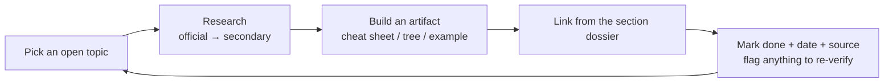

# Research Log — Deepening Each Competency Area

This repo's section dossiers are the **research-backed foundation**. This log is the **living tracker** for
the next phase: pushing each area from "covered" to **mastered**, one verified topic at a time. Update it as
you research, build artifacts, and confirm against the official blueprint.

---

## How to use this log

1. Pick an area from the matrix below with an open `[ ]`.
2. Research it against **official authority first** (2026 Blueprint, FASB/GASB/PCAOB/IRC/NIST), then trusted
   secondary sources.
3. Produce a **concrete artifact** (a cheat sheet, decision tree, worked example, or template) and link it
   from the relevant section dossier's "Deeper-research TODO."
4. Mark it done with a date and source, and note anything to **verify** later.



---

## Coverage status (Phase 1 = this build)

| Area | Foundation dossier | Blueprint weights captured | Connections mapped | Deep artifacts built |
|---|---|---|---|---|
| FAR | ✅ [`../sections/core-FAR.md`](../sections/core-FAR.md) | ✅ | ✅ | ✅ [`../sections/deep-dives/FAR-deep-dive.md`](../sections/deep-dives/FAR-deep-dive.md) |
| AUD | ✅ [`../sections/core-AUD.md`](../sections/core-AUD.md) | ✅ | ✅ | ✅ [`../sections/deep-dives/AUD-deep-dive.md`](../sections/deep-dives/AUD-deep-dive.md) |
| REG | ✅ [`../sections/core-REG.md`](../sections/core-REG.md) | ✅ | ✅ | ✅ [`../sections/deep-dives/REG-deep-dive.md`](../sections/deep-dives/REG-deep-dive.md) |
| BAR | ✅ [`../sections/discipline-BAR.md`](../sections/discipline-BAR.md) | ✅ | ✅ | ✅ [`../sections/deep-dives/BAR-deep-dive.md`](../sections/deep-dives/BAR-deep-dive.md) |
| ISC | ✅ [`../sections/discipline-ISC.md`](../sections/discipline-ISC.md) | ✅ | ✅ | ✅ [`../sections/deep-dives/ISC-deep-dive.md`](../sections/deep-dives/ISC-deep-dive.md) |
| TCP | ✅ [`../sections/discipline-TCP.md`](../sections/discipline-TCP.md) | ✅ | ✅ | ✅ [`../sections/deep-dives/TCP-deep-dive.md`](../sections/deep-dives/TCP-deep-dive.md) |

> **Phase 1 (done):** roadmap/web, exam architecture, foundations, six research-backed section dossiers,
> study plan, resources, logistics.
> **Phase 2 (done):** deep-dive artifacts for **all six** sections (3 Cores + 3 Disciplines), plus the
> **OBBBA July 1, 2026 testability cutoff** verified for REG/TCP.
> **Phase 3 (done):** the **study app** (`/app`) — planner, 168-card spaced-repetition deck, 114-question
> practice bank, error log, readiness gates, data export — with a 37-assertion automated test suite.
> **Phase 4 (next):** verification queue below (verbatim blueprint topic lists, indexed tax figures),
> growing the question/card banks, and TBS-style practice scenarios.

---

## Phase 2 — prioritized research backlog

Ordered roughly by exam impact. Each links back to the dossier that owns it.

### FAR — ✅ deep-dive built: [`../sections/deep-dives/FAR-deep-dive.md`](../sections/deep-dives/FAR-deep-dive.md)
- [x] **ASC 606** five-step decision flow + 5 variable-consideration worked examples
- [x] **Lease (842) lessee** decision tree + ROU/liability rollforward template
- [x] **Book-to-tax (M-1) bridge** worksheet (hands off to REG)
- [x] **Cash-flow (indirect)** add-back/classification quick sheet
- [x] **Gov vs. NFP** statement-name + reconciliation cheat sheet
- [ ] Verbatim **Area I–III topic list** from official 2026 blueprint PDF *(verification queue)*

### AUD — ✅ deep-dive built: [`../sections/deep-dives/AUD-deep-dive.md`](../sections/deep-dives/AUD-deep-dive.md)
- [x] **Independence matrix** (engagement × AICPA/SEC/PCAOB/GAO/DOL)
- [x] **Report-decision tree** (opinion → modification → required paragraphs)
- [x] **SSARS vs. audit vs. attestation** service grid
- [x] **COSO 5 components / 17 principles** → example controls (feeds ISC)
- [x] **Sampling** quick reference (attributes vs. variables; sample-size drivers)

### REG — ✅ deep-dive built: [`../sections/deep-dives/REG-deep-dive.md`](../sections/deep-dives/REG-deep-dive.md)
- [x] **Basis master sheet** (asset · partner outside · S-corp stock ordering · C-corp E&P)
- [x] **3-entity comparison** (C/S/partnership): formation, basis, character, distributions, losses
- [x] **Loss-limitation ordering** flow (basis → at-risk → passive) + examples
- [x] **Business-law rule grid** (contracts, agency, secured txns, bankruptcy)
- [x] **Property dispositions & character** (§1231/1245/1250 · §1031 · installment) + **OBBBA 2025 change log**

### BAR — ✅ deep-dive built: [`../sections/deep-dives/BAR-deep-dive.md`](../sections/deep-dives/BAR-deep-dive.md)
- [x] **Ratio dictionary** (formula + diagnosis + benchmark direction) + DuPont
- [x] **Hedge accounting** decision sheet (fair-value / cash-flow / net-investment)
- [x] **Advanced consolidation** template (intercompany, NCI, step acquisition)
- [x] **Gov-wide ↔ fund reconciliation** worked example
- [x] **Cost/variance** formula sheet + breakeven/capital budgeting

### ISC — ✅ deep-dive built: [`../sections/deep-dives/ISC-deep-dive.md`](../sections/deep-dives/ISC-deep-dive.md)
- [x] **SOC matrix** (1/2/3/Cyber × Type 1/2 × user × Trust Services Criteria)
- [x] **Framework comparison** (NIST CSF 2.0 vs. COBIT vs. CIS vs. ISO 27001)
- [x] **Data life-cycle** diagram with controls per stage
- [x] **IAM / access-control** quick sheet
- [x] **Privacy-regime** comparison (HIPAA / GDPR / PCI-DSS / CCPA / GLBA)

### TCP — ✅ deep-dive built: [`../sections/deep-dives/TCP-deep-dive.md`](../sections/deep-dives/TCP-deep-dive.md)
- [x] **Basis & distribution** templates (partner outside basis, S-corp AAA/stock basis)
- [x] **Property-disposition** planning map (§1031 · installment · §1202 · §1033 · related-party)
- [x] **Entity-selection** decision framework
- [x] **AMT** flow + **equity-comp** timing sheet (ISO/NQSO/RSU)
- [x] **Trust DNI** & estate/gift quick reference

---

## Verification queue (things to re-confirm against primary sources)

- [ ] Exact **area weight ranges** and **skill-level splits** per the official 2026 Blueprint PDF
  (current numbers in the dossiers are from the blueprint + reputable secondary sources — confirm verbatim).
- [ ] **Current pass rates** — refresh each quarter from the AICPA pass-rate page (figures here are Q1 2026 context).
- [ ] **Credit window** (18 vs. 30 months) for **my specific jurisdiction**.
- [ ] **Discipline testing windows** and **score-release dates** for my target sit months.
- [ ] **Review-course** features/pricing before any purchase.
- [x] **OBBBA testability** — VERIFIED: testable on REG/TCP starting **July 1, 2026**; sit before then = pre-OBBBA
  law. (Sources: Gleim, eduyush, Atlas CPA Index, board360 — Jun 2026.) Indexed dollar figures still need
  per-year confirmation.
- [ ] **Indexed tax figures** for the testable year (gift exclusion, unified exemption, AMT exemption/phaseout,
  §179 limit, estimated-tax thresholds).

---

## Research session notes

Append dated entries as you go. Template:

```
### YYYY-MM-DD — <area/topic>
- Source(s): <official link(s) + any secondary>
- Found: <key facts / numbers / rules>
- Artifact: <what you built + where it lives>
- Verify later: <anything uncertain>
```

### 2026-06-10 — Phase 3: the study app
- Built `/app`: dependency-free vanilla-JS study application (works over file:// or any static server).
  Views: Dashboard, Study Plan (12/16/24-week generator with sequence/Discipline choice + Jan/Apr/Jul/Oct
  Discipline-window check), Flashcards (168 cards, SM-2-lite spaced repetition), Practice (114 original
  blueprint-tagged MCQs with explanations + per-area stats vs. readiness targets), Error Log (pattern
  analysis + CSV export), Readiness (foundations R/Y/G + per-section go/no-go gates), Data (JSON
  export/import). All progress in localStorage.
- Content sourced from the Phase-2 deep-dive sheets; indexed tax dollar amounts avoided or flagged
  (stable statutory thresholds like FBAR $10k and the 110%/$150k safe harbor retained).
- Quality: `npm test` → 37-assertion jsdom smoke suite (data integrity incl. unique IDs/valid areas/4
  choices per question, all 36 planner combinations, SRS interval math, quiz scoring, error log, readiness
  verdicts, export/import roundtrip). All passing.
- Verify later: grow question bank toward area-weight proportions; add TBS-style scenarios.

### 2026-06-07 — Phase 2b: Discipline deep-dives + OBBBA cutoff verified
- Sources: AICPA pronouncement-testability policy (later of: Q after earliest mandatory effective date, or
  Q beginning 6 months after issuance); OBBBA→CPA-exam coverage (Gleim, eduyush, Atlas CPA Index, board360);
  TCP topic research (DNI/fiduciary, estate & gift, AMT, ISO/NQSO/RSU).
- Found: **OBBBA (2024/2025 provisions) testable on REG & TCP starting July 1, 2026**; before that =
  pre-OBBBA law; FAR/AUD/BAR/ISC unaffected. Confirmed TCP tests trust DNI, estate/gift (unified credit,
  gift-splitting, GST, A-B/GRAT/CRT/FLP), AMT (ISO preference), equity comp.
- Artifacts: `sections/deep-dives/BAR-deep-dive.md` (ratios/DuPont, variances, breakeven/capital budgeting,
  advanced consolidations, hedge accounting, gov reconciliation); `ISC-deep-dive.md` (SOC matrix, TSC,
  framework comparison + NIST CSF 2.0 functions, data life cycle, IAM, privacy regimes);
  `TCP-deep-dive.md` (owner basis/AAA, entity selection, disposition planning, AMT, equity comp, trusts/
  estate/gift) + OBBBA cutoff cross-reference. Updated REG-deep-dive §6 with the July 1, 2026 cutoff table.
- Verify later: indexed dollar figures per testable year; verbatim blueprint topic lists.

### 2026-06-07 — Phase 2: Core deep-dives
- Sources: FASB ASC / IRC / COSO / AICPA-PCAOB knowledge; AICPA 2026 blueprint structure; **OBBBA 2025**
  research (thetaxadviser, Grant Thornton, Plante Moran, Baker Tilly summaries); FAR lease/CECL emphasis checks.
- Found: confirmed FAR tests ASC 606 / 842 / CECL; **OBBBA (enacted 2025-07-04)** restored 100% bonus
  depreciation, raised §179 limits, created tiered **§1202** exclusion (50/75/100% at 3/4/5 yrs; $15M/$75M
  caps), made §461(l) permanent.
- Artifacts: `sections/deep-dives/FAR-deep-dive.md` (606, 842, cash flows, M-1 bridge, gov/NFP);
  `AUD-deep-dive.md` (independence matrix, report tree, service grid, COSO, sampling);
  `REG-deep-dive.md` (basis master sheet, 3-entity comparison, loss ordering, dispositions, business-law
  grid, OBBBA change log).
- Verify later: AICPA testable-law cutoff per 2026 window for OBBBA; indexed dollar thresholds; current
  AICPA report-section wording; verbatim blueprint topic lists.

### 2026-06-07 — Phase 1 build
- Sources: user-provided "U.S. CPA Exam Mastery Roadmap" PDF; AICPA 2026 Blueprint (via aicpa-cima.com /
  ctfassets); UWorld/Becker blueprint summaries; NIST/COSO references.
- Found: Core+Discipline structure; per-section item counts & MCQ/TBS weights; area weights & skill splits
  for all six sections; Q1 2026 pass-rate context; resource stack; phased plans.
- Artifact: full repo — roadmap/web, architecture, foundations, six dossiers, study plan, resources, logistics.
- Verify later: exact blueprint weight ranges & skill splits verbatim from the official PDF; jurisdiction
  credit window; live pass rates.
