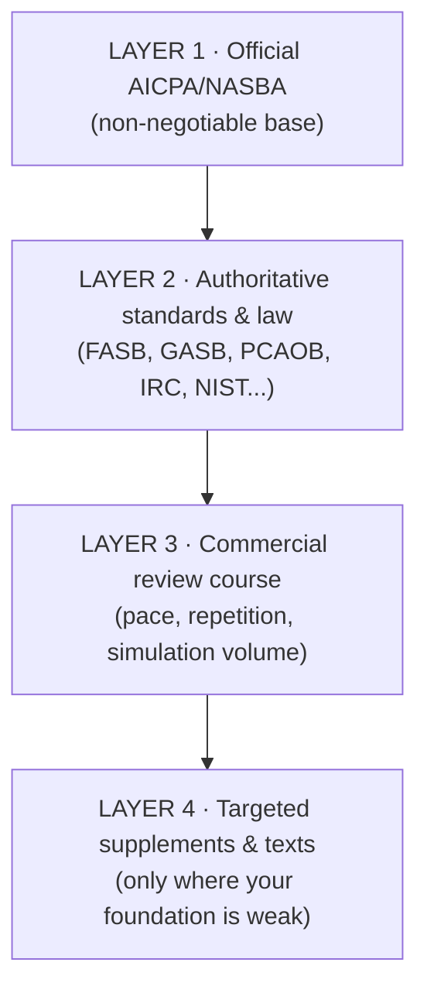
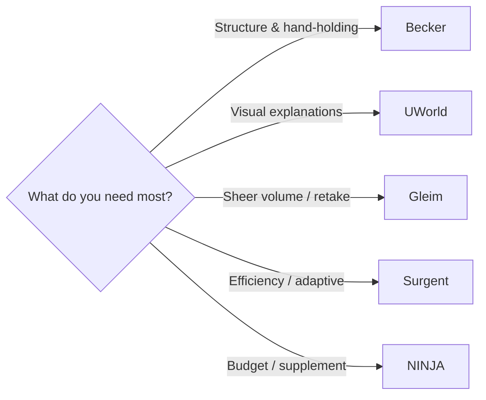
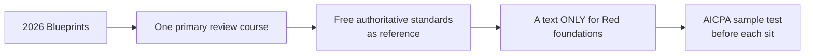

# Resource Stack

Resources ordered from **highest-value official sources** to commercial supplements. Use official materials
as the mandatory base layer; commercial materials earn their place through repetition, practice volume, and
pacing — **not** by overriding the AICPA blueprint.

> ⚠️ Vendor features/pricing and even some official documents change. Verify links and details before
> relying or purchasing.

---

## 1. The layered approach

**Rule:** the blueprint is your syllabus; everything else *serves* it.

---

## 2. Layer 1 — Official (must-have)

| Resource | Best use | Link |
|---|---|---|
| **AICPA Uniform CPA Exam Blueprints — eff. Jan 1, 2026** | Build your syllabus; track coverage; diagnose weak areas | `assets.ctfassets.net/.../CPA_Exam_Blueprints_2026.pdf` (via aicpa-cima.com) |
| **AICPA sample test & tutorial** | Learn exam software/tools before test day; reduce avoidable friction | aicpa-cima.com → "Practice for the CPA Exam with sample tests" |
| **NASBA CPA Exam Candidate Guide** | Scheduling, ID, breaks, test-center rules, score flow | `nasba.org` (Candidate Guide PDF) |
| **AICPA score-release schedule** | Plan sitting dates & retakes (esp. Discipline windows) | aicpa-cima.com → "Find out when you'll get your CPA Exam score" |
| **NASBA score information** | Score timing & jurisdiction routing | `nasba.org/exams/cpaexam/scores/` |
| **ThisWayToCPA** | Average study-time context; licensure navigation; state requirements | `thiswaytocpa.com` |

---

## 3. Layer 2 — Authoritative standards & law (free, by section)

| Authority | Section(s) | Use | Link |
|---|---|---|---|
| **AICPA Code of Professional Conduct & Ethics** | AUD, REG | Ethics, independence, professional behavior | aicpa-cima.com/resources/landing/aicpa-ethics |
| **PCAOB Auditing Standards** | AUD | Issuer-audit standards | `pcaobus.org/oversight/standards/auditing-standards` |
| **FASB ASC & Concepts** | FAR, BAR | Technical accounting research | `asc.fasb.org` |
| **GASB / GARS** | FAR (gov basics), BAR (gov depth) | State/local government accounting | `gasb.org` |
| **IRS site, Circular 230, forms, pubs** | REG, TCP | Tax law & administrative guidance | `irs.gov` |
| **SEC EDGAR** | FAR, AUD, BAR | Real filings, disclosures, non-GAAP reconciliations | `sec.gov/search-filings` |
| **NIST CSF 2.0 & Privacy Framework; CIS; COBIT** | ISC | Cybersecurity & control frameworks | `nvlpubs.nist.gov/.../NIST.CSWP.29.pdf` |

---

## 4. Layer 3 — Commercial review courses (pick one primary)

Vendor-stated positioning (verify current features/pricing before buying):

| Course | Differentiators (vendor-stated) | Best fit | Caution |
|---|---|---|---|
| **Becker** | 900+ concept videos, 9,000+ MCQs, 900+ TBSs, simulated & mini exams, structured packages | Want a full, highly structured system with assigned practice | Typically high cost; structure helps **only if you follow it** |
| **UWorld CPA Review** | 9,000+ exam-like questions, strong visual explanations | Visual learners; learn from answer rationales | Marketing is strong — confirm you like the interface/teaching style |
| **Gleim** | 12,000+ MCQs, 1,200+ TBSs (Mega Test Bank), mock exams | Retakers; volume-drillers; detail-oriented learners | Can feel dense if you overwhelm easily |
| **Surgent** | Adaptive tech, weaker-area targeting | Busy candidates needing efficiency & triage | Adaptive works best only if your diagnostics are honest/frequent |
| **NINJA** | Lower-cost subscription, large supplemental bank, notes, audio | Budget-conscious; supplement for retakes / extra MCQ volume | Usually better as a **supplement** unless you're self-directed with basics down |

---

## 5. Layer 4 — Textbooks (strategic, not your primary engine)

Use when your conceptual foundation is weak — not as the main exam engine.

| Need | Text | Best use |
|---|---|---|
| Intermediate financial reporting | Kieso, Weygandt & Warfield *Intermediate Accounting*; or Spiceland et al. | FAR statement mechanics, B/S accounts, revenue, leases, income taxes |
| Auditing | Arens et al., *Auditing and Assurance Services* | AUD concepts, evidence, risk, reporting |
| Advanced accounting | Hoyle et al., *Advanced Accounting* | FAR/BAR consolidations, business combinations, foreign currency |
| Governmental & NFP | Granof et al., *Government and Not-for-Profit Accounting* | FAR gov/NFP basics; BAR governmental depth |
| Federal taxation | *South-Western Federal Taxation 2026* (individual/corporate/comprehensive) | REG/TCP basis, entity rules, planning structure |

---

## 6. A sensible starter kit

1. **2026 Blueprints** (free) — your master syllabus.
2. **One primary review course** — for pacing, MCQ/TBS volume, mocks.
3. **Free authoritative standards** — for research-TBS practice and depth.
4. **A targeted text** — only where a foundation is Red.
5. **AICPA sample test** — run it before every sit for software familiarity.

> Don't buy two full courses. Buy one, finish it, and supplement narrowly (e.g., NINJA MCQs for extra
> volume) only if a weak area demands it.

Legacy BEC materials? See [`02-bec-crosswalk.md`](02-bec-crosswalk.md) before reusing anything.
