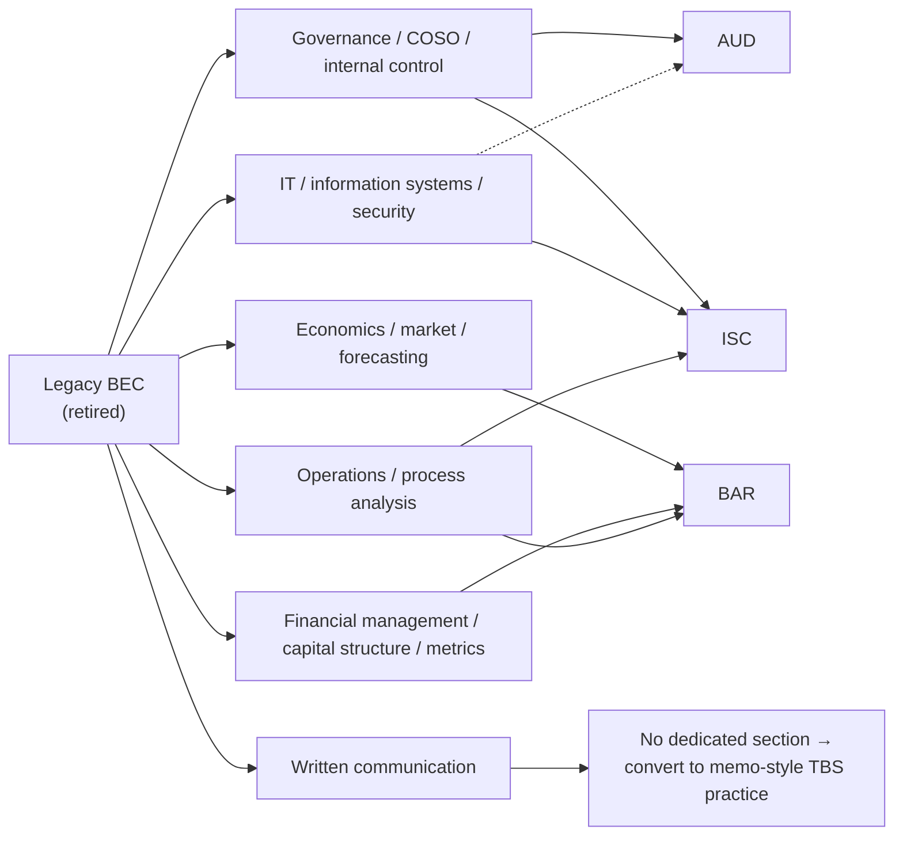

# Legacy BEC Crosswalk

**BEC is retired.** There is no January 1, 2026 BEC blueprint and no BEC section on the current exam. This
page is a **crosswalk**, not a blueprint map: if you own old BEC materials, use them **only after remapping**
their topics to current sections. Don't follow old BEC outlines literally.

---

## Where each old BEC theme now lives

| Old BEC theme | Now mostly lives in | How to reuse old notes safely |
|---|---|---|
| Corporate governance, control environment, internal control | **AUD** and **ISC** | Keep COSO/governance/internal-control notes; reframe around **audit risk, ITGCs, SOC, and cyber controls** |
| Economics, market influences, forecasting | **BAR** | Keep economics **only** where it connects to forecasting, budgeting, cost structure, market analysis |
| Financial management, capital structure, performance metrics | **BAR** | Reuse finance formulas & ratio logic, but expect **more analysis & data interpretation** than old BEC recall |
| Information technology, information systems, security | **ISC** (and some **AUD**) | Keep systems/security notes **only** if they map to cloud, AIS/ERP, NIST/CIS/COBIT, privacy, incident response, SOC |
| Operations management & process analysis | **BAR** and **ISC** | Reuse process improvement, variance analysis, throughput, data-flow material |
| Written-communication tasks | **No direct section** | 2026 sections use **MCQs and TBSs only**; convert old written prompts into **memo-style TBS** practice |

---

## What to throw away vs. keep

**Keep (after remapping):**
- COSO framework and internal-control fundamentals → AUD/ISC.
- Finance/ratio formulas and cost-variance mechanics → BAR.
- IT general controls and systems concepts → ISC.

**Discard or heavily downgrade:**
- BEC's standalone **written-communication** drills (no longer a testlet).
- Any BEC topic outline used as a **coverage checklist** — use the **2026 blueprints** instead.
- Depth/emphasis levels from BEC — the current sections test these ideas at **different cognitive levels**
  (e.g., BAR wants analysis, not BEC-style recall).

---

## The one rule

> **Never let old BEC materials define your scope.** Let the **2026 AICPA Blueprints** define scope; use BEC
> notes only as raw material you re-slot into AUD, BAR, or ISC. When in doubt, trust the blueprint.

Section dossiers that absorb former BEC content: [`../sections/core-AUD.md`](../sections/core-AUD.md),
[`../sections/discipline-BAR.md`](../sections/discipline-BAR.md),
[`../sections/discipline-ISC.md`](../sections/discipline-ISC.md).
