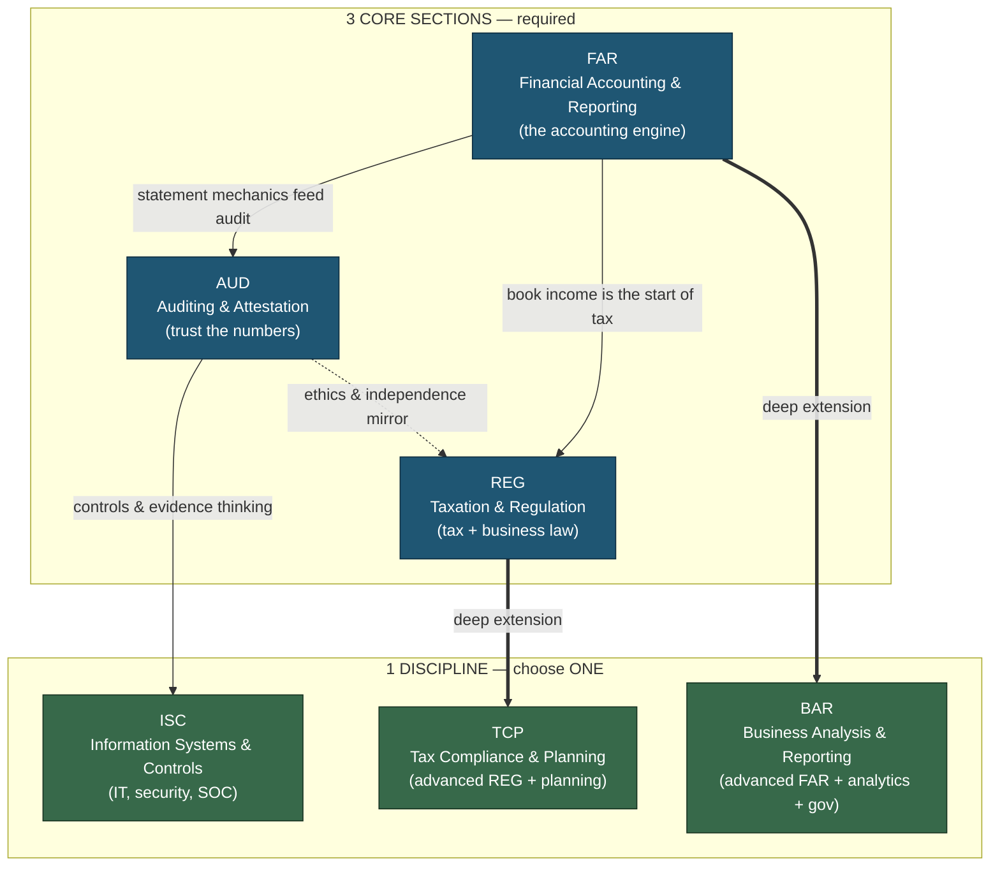
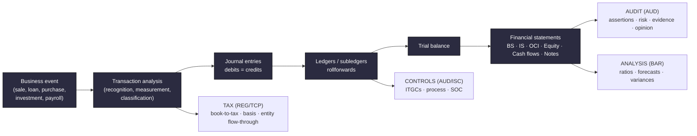
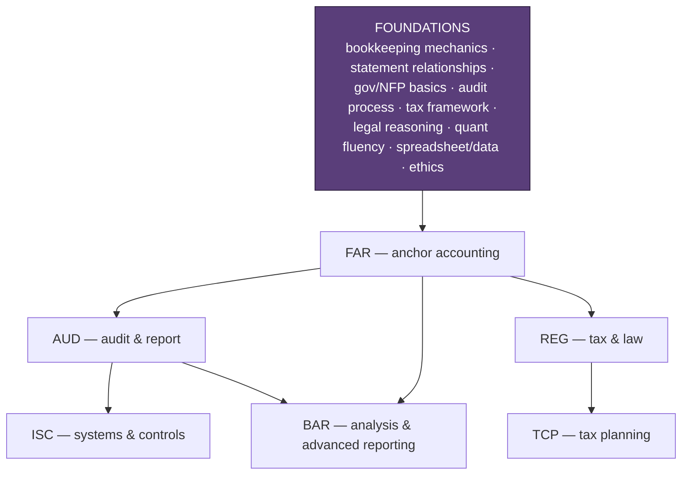
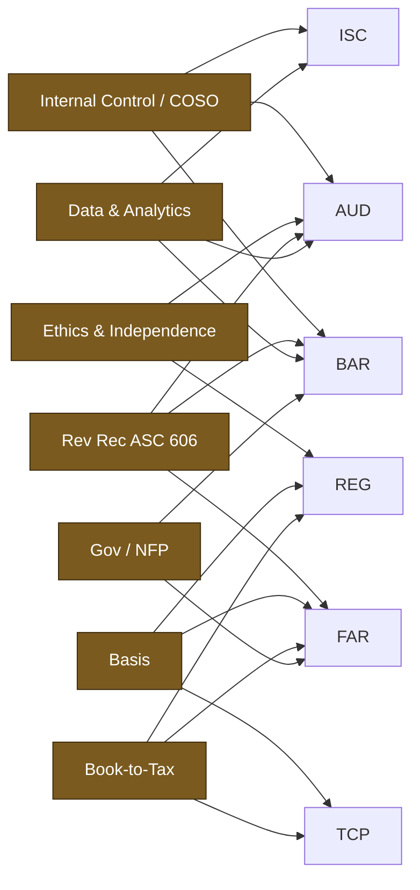
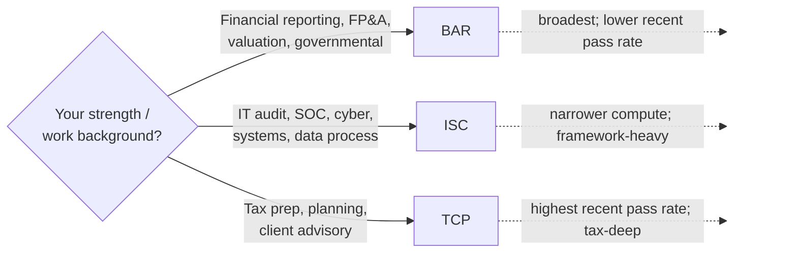
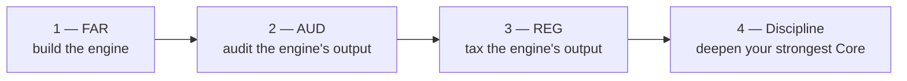

# Master Roadmap — The CPA Knowledge Web

This is the map of *everything* the exam tests and *how it connects*. The CPA Exam looks like four
unrelated subjects, but underneath it is **one spine**: a business event becomes a **transaction**,
which becomes **journal entries**, which roll up into **financial statements**, which are **audited**,
**taxed**, **analyzed**, and **controlled**. Master the spine and every section gets easier.

- Mermaid diagrams below render automatically on GitHub.
- Each section node links to its full dossier in [`../sections/`](../sections/).

---

## 1. The whole exam in one picture

**Read it as:** FAR is the hub. AUD audits what FAR produces. REG taxes what FAR produces. Each Discipline
is a *deepening* of a Core you already studied — BAR extends FAR, TCP extends REG, and ISC extends the
controls/IT thinking inside AUD. **Choosing a Discipline that extends your strongest Core is the highest-leverage decision in the whole plan.**

---

## 2. The common spine (why order matters)

**Takeaway:** every downstream section (audit, tax, analysis, controls) reaches *back* into the same
transaction-to-statement spine. If your bookkeeping mechanics are fluent, all four sections share one
engine. If they're shaky, every section feels like a different language. This is why **FAR is almost
always studied first.**

---

## 3. The dependency map (what unlocks what)

Foundations are detailed in [`../foundations/00-prerequisites.md`](../foundations/00-prerequisites.md).
The arrows are *learning efficiency*, not legal prerequisites — administratively you may sit the four
sections in any order.

---

## 4. Cross-cutting threads (the same idea, tested in multiple sections)

These concepts appear in more than one section. Learn them **once, deeply**, and bank points everywhere.

| Thread | Where it shows up | The connection |
|---|---|---|
| **Internal control / COSO** | AUD (test controls), ISC (ITGCs, SOC), BAR (governance) | One control framework, three lenses: audit evidence, IT systems, business risk. |
| **Ethics & independence** | AUD (AICPA/SEC/PCAOB/GAO/DOL), REG (Circular 230, preparer rules) | "Which authority governs this fact pattern?" is the same skill in both. |
| **Revenue recognition (ASC 606)** | FAR (5-step model), BAR (deeper contracts), AUD (revenue is a fraud-risk area) | Recognize it (FAR), analyze it (BAR), audit it (AUD). |
| **Leases (ASC 842)** | FAR (lessee), BAR (lessor) | Same standard, opposite side of the contract. |
| **Business combinations & consolidation** | FAR (basics), BAR (advanced, intercompany, NCI) | BAR is "FAR consolidations, leveled up." |
| **Governmental & NFP accounting** | FAR (foundational GASB/NFP), BAR (full government-wide + fund reconciliations) | FAR plants it; BAR expands it. |
| **Basis** | REG (individual & entity basis), TCP (planning around basis), FAR (asset cost) | The most reused number in tax — outside basis, inside basis, stock/partnership basis. |
| **Book-to-tax differences** | FAR (book income), REG (Schedule M adjustments), TCP (entity planning) | Permanent vs. temporary differences tie FAR's income taxes to REG/TCP. |
| **Data & analytics** | AUD (data reliability, sampling), BAR (data viz, ratios), ISC (data lifecycle, SQL) | Validate data → analyze data → govern data. |
| **Estimates & fair value** | FAR (measurement), AUD (auditing estimates) | FAR makes the estimate; AUD challenges it. |

---

## 5. Section-to-Discipline routing

Your Discipline should usually deepen your strongest Core and match your work/interests (the AICPA's own
advice). Pass rates can inform time budgeting but should **not** override fit.

Full routing logic and recent pass-rate context: [`../study-plan/01-sequence-and-hours.md`](../study-plan/01-sequence-and-hours.md).

---

## 6. Recommended default path

**FAR → AUD → REG → Discipline** is the strongest default because it follows the dependency arrows and
front-loads the broadest, lowest-pass-rate Core while your stamina is highest. It is an *analytical
recommendation*, not an official AICPA rule. Specialist alternatives (tax-first, IT-audit-first) are in the
study plan. **2026 scheduling constraint:** Disciplines are administered only in the **first month of each
quarter (Jan, Apr, Jul, Oct)** — plan the Discipline sit around that window.

---

## 7. Where the points are (effort allocation heat map)

| Section | Heaviest areas (study here first) | Lightest area |
|---|---|---|
| **FAR** | Select Balance Sheet Accounts (30–40%) + Financial Reporting (30–40%) | Select Transactions (20–30%) |
| **AUD** | Performing Procedures & Evidence (30–40%) + Risk/Planned Response (25–35%) | Conclusions & Reporting (10–20%) |
| **REG** | Entity Tax (23–33%) + Individual Tax (22–32%) | Property Transactions (5–15%) |
| **BAR** | Business Analysis (40–50%) + Technical Accounting (35–45%) | State & Local Gov (10–20%) |
| **ISC** | Info Systems & Data Mgmt (35–45%) + Security/Confidentiality/Privacy (35–45%) | SOC Engagements (15–25%) |
| **TCP** | Individual Compliance/PFP (30–40%) + Entity Compliance (30–40%) | Entity Planning / Property (10–20% each) |

Detailed weights, topics, and skill-level splits live in each section dossier.

---

## 8. How to read each section dossier

Every file in [`../sections/`](../sections/) follows the same template so you can navigate fast:

1. **Snapshot** — format, weights, skill mix, recent pass-rate context.
2. **Blueprint area breakdown** — each area's weight, topics, learning objectives, likely item forms.
3. **High-yield clusters** — the handful of topics that decide pass/fail.
4. **Connections** — what this section borrows from / lends to the others (links back into this web).
5. **Representative TBS types** — what the simulations actually ask you to do.
6. **Common pitfalls & the hard truth** — how candidates lose easy points.
7. **Resources for this section** — official authorities + targeted supplements.
8. **Deeper-research TODO** — open threads to push from "covered" to "mastered."

---

### Next steps
- New here → [`02-exam-architecture.md`](02-exam-architecture.md) then [`../foundations/00-prerequisites.md`](../foundations/00-prerequisites.md)
- Ready to plan → [`../study-plan/01-sequence-and-hours.md`](../study-plan/01-sequence-and-hours.md)
- Ready to study → start with [`../sections/core-FAR.md`](../sections/core-FAR.md)
