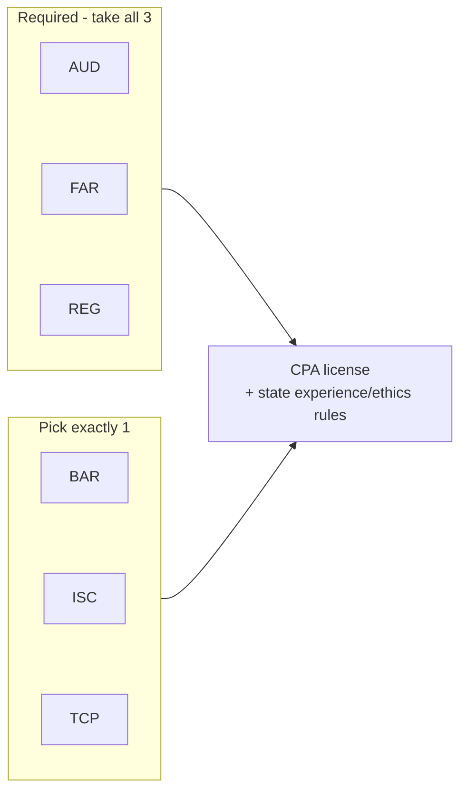
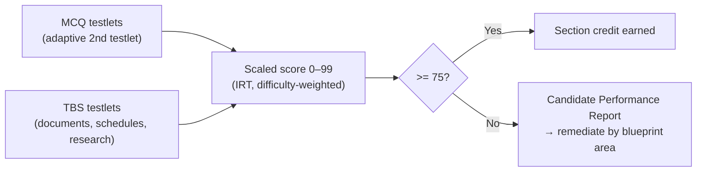
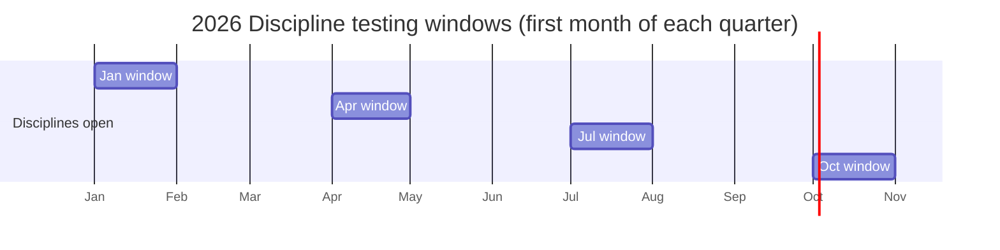

# Exam Architecture, Scoring & Scheduling

Everything about *how* the exam is structured, scored, and scheduled — the logistics layer that sits
underneath the content. Confirm jurisdiction-specific items with your state board before relying on them.

---

## 1. The Core + Discipline model

Since **January 1, 2024**, the Uniform CPA Examination is built on the **CPA Evolution** model:

- **3 Core sections (everyone takes all three):** AUD, FAR, REG.
- **1 Discipline section (choose exactly one):** BAR, ISC, or TCP.
- **Total: 4 sections.** Your license is the same regardless of which Discipline you pick — the Discipline
  is not a "specialty license," just the fourth exam.
- **BEC is retired.** There is no written-communication testlet in the current exam.

---

## 2. Section design (what a sitting looks like)

| Section | Length | MCQ | TBS | MCQ/TBS score weight | Notes |
|---|---|---|---|---|---|
| **AUD** | 4 hrs | 78 | 7 | 50% / 50% | Densest concepts; only section testing the **Evaluation** skill. |
| **FAR** | 4 hrs | 50 | 7 | 50% / 50% | Broadest accounting; document-heavy TBSs. |
| **REG** | 4 hrs | 72 | 8 | 50% / 50% | Most TBSs (8); structure & basis driven. |
| **BAR** | 4 hrs | 50 | 7 | 50% / 50% | Broadest Discipline; analysis-heavy. |
| **ISC** | 4 hrs | 82 | 6 | **60% / 40%** | Most MCQs; the only **60/40** split. |
| **TCP** | 4 hrs | 68 | 7 | 50% / 50% | Application-dominant; planning scenarios. |

**Item types**
- **MCQ (multiple-choice):** delivered in two testlets; the second adapts in difficulty based on the first.
- **TBS (task-based simulation):** document review, schedules, rollforwards, journal entries, form/return
  prep, research using an authoritative-literature excerpt, and memo-style written responses inside a TBS.
- There is **no standalone written-communication testlet** anymore (that was BEC).

**Break structure:** a **15-minute standardized break** is offered after the first TBS testlet and **does
not** count against your 4 hours. Other breaks are optional but the clock keeps running.

---

## 3. Scoring mechanics

- **Scale:** 0–99. **Passing = 75.**
- **75 is not "75% correct"** and the exam is **not curved.** Scores are scaled using item-response theory
  that accounts for question difficulty. MCQ and TBS contribute per the weights above (50/50, except ISC 60/40).
- **Pretest items:** some questions are unscored "pretest" items you can't identify — answer everything.
- **Candidate Performance Report:** if you fail, you receive a report showing relative performance by
  **content area** and **item type** (Weaker / Comparable / Stronger). This is your remediation map — see
  [`../study-plan/04-assessment-remediation.md`](../study-plan/04-assessment-remediation.md).

---

## 4. The skill levels (Bloom-style) the blueprint tests

The blueprint tags every task with a skill level. Knowing the mix tells you *how* to study a section.

| Skill level | What it means | Heaviest in |
|---|---|---|
| **Remembering & Understanding** | Recall and explain rules/terms | ISC, REG Areas I–II |
| **Application** | Use a rule in a scenario; compute | FAR, BAR, TCP, REG tax areas |
| **Analysis** | Compare, reconcile, interpret relationships | BAR, FAR, REG/TCP entity work |
| **Evaluation** | Judge sufficiency/appropriateness (form an opinion) | **AUD only** |

> Approximate skill splits (ranges, per 2026 blueprint):
> - **AUD:** R&U 30–40 · Application 30–40 · Analysis 15–25 · **Evaluation 5–15**
> - **FAR:** R&U 5–15 · Application ~50–60 · Analysis 35–45 (Application-dominant)
> - **REG:** R&U 25–35 · Application 35–45 · Analysis 25–35
> - **BAR:** R&U 10–20 · Application 45–55 · Analysis 30–40
> - **ISC:** R&U 55–65 · Application 35–45 (no Analysis/Evaluation) — heaviest memorize-and-understand load
> - **TCP:** R&U 5–15 · Application 55–65 · Analysis 25–35
>
> Treat as planning guidance; exact per-form weights are not published.

---

## 5. Scheduling & the testing calendar

- **Cores (AUD, FAR, REG):** offered on a **continuous** testing basis (subject to Prometric availability).
- **Disciplines (BAR, ISC, TCP):** in **2026 administered only in the first month of each quarter —
  January, April, July, October.** This is a hard scheduling constraint: back-plan your Discipline sit to
  land in one of those windows.
- **Score release:** the AICPA publishes target score-release dates each year (tied to your sit date and
  the close of testing windows). Plan retake timing around the published schedule.

---

## 6. The credit window (⚠️ jurisdiction-specific — verify)

- The score-credit window is the time you have to pass **all four** sections after passing your **first**.
- **There is a known inconsistency in official documents:** the March 2025 NASBA Candidate Guide still
  references an **18-month** window, while NASBA's amended **UAA Model Rule provides 30 months from score
  release**, and **many (not all) jurisdictions have adopted the longer 30-month window.**
- **Action:** do **not** rely on a generic number. Confirm your **state board's** current credit window,
  start trigger (score release vs. sit date), and any COVID-era extensions before you file or count time.

---

## 7. The path from exam to license (context)

Passing the exam is necessary but not sufficient for licensure. Most jurisdictions also require:

- **Education:** typically 150 semester hours (varies; some states piloting alternative pathways).
- **Experience:** generally ~1 year of qualifying experience signed off by a CPA (varies).
- **Ethics exam:** many states require the **AICPA Professional Ethics** course/exam (separate from the
  Uniform CPA Exam).

These are governed by your **state board of accountancy**, not the AICPA. Use NASBA's jurisdiction pages
and your board's site to confirm.

---

### Verify-before-relying checklist
- [ ] My state's **credit window** (18 vs. 30 months) and what starts the clock
- [ ] My state's **education** requirement and whether I'm eligible to sit now
- [ ] **Experience** and **ethics-exam** requirements for licensure
- [ ] Current **score-release** dates for my planned sit months
- [ ] **Prometric** availability for my preferred dates (schedule early)

Logistics detail (IDs, breaks, test-center rules) → [`../logistics/exam-day.md`](../logistics/exam-day.md).
