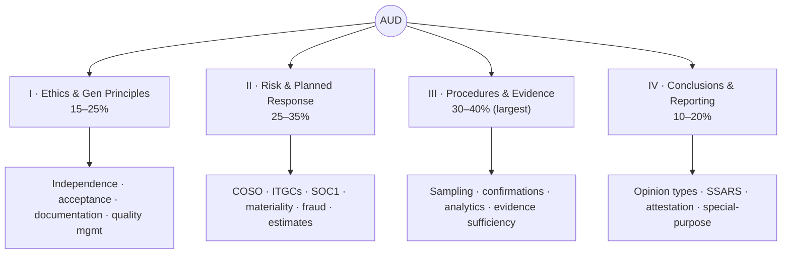
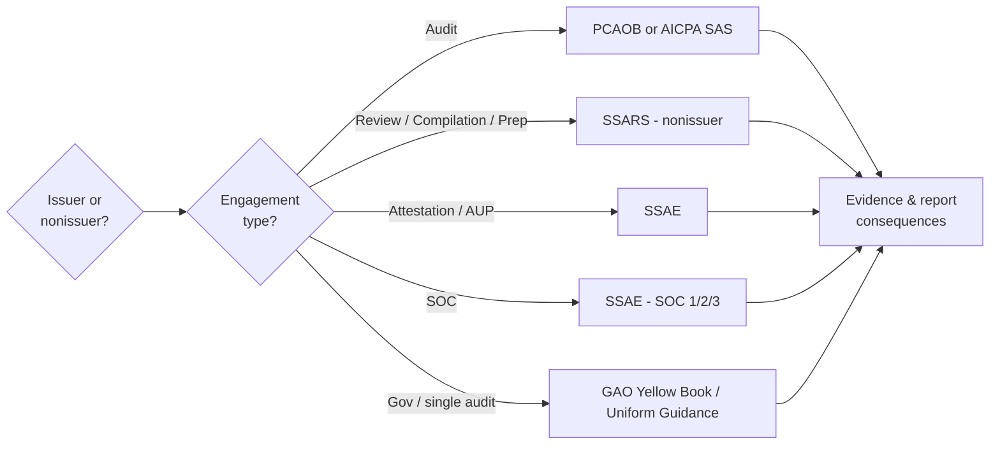
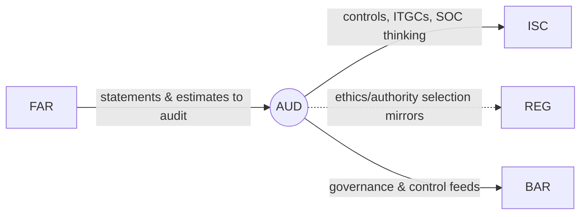

# AUD — Auditing & Attestation (Core)

> "Trust the numbers." AUD is the most *judgment*-heavy section — the **only** one that tests the
> **Evaluation** skill. It's conceptually dense and full of look-alike situations that flip based on
> engagement type and governing authority. Win it by labeling the engagement *before* you answer.

---

## 1. Snapshot

| Attribute | Detail |
|---|---|
| Status | **Core** (required) |
| Length / format | 4 hours · **78 MCQ + 7 TBS** · 50% MCQ / 50% TBS |
| Skill emphasis | **Balanced** — R&U 30–40 · Application 30–40 · Analysis 15–25 · **Evaluation 5–15** (unique to AUD) |
| Governing authorities | **AICPA (SAS/SSAE/SSARS)**, **PCAOB AS** (issuers), **GAO/Yellow Book**, **DOL** (EBP), SEC independence |
| Recent pass rate (Q1 2026, context) | ~**48%** |
| Recommended hours | **90–110** (add 15–25 if you've never worked in audit) |

**The core habit:** for every item, identify **(1) engagement type** (audit / review / compilation /
preparation / attestation / SOC / compliance) → **(2) reporting framework & issuer vs. nonissuer** →
**(3) the evidence or reporting consequence that follows.** Answering from memory without this anchoring is
how candidates miss easy points.

---

## 2. Blueprint area breakdown (2026)

### Area I — Ethics, Professional Responsibilities & General Principles · **15–25%**
- **Ethics & independence** across **AICPA, SEC, PCAOB, GAO, DOL** contexts
- Engagement **acceptance & continuance**; **engagement letters**; preconditions
- **Documentation**, file assembly & retention
- Communications with **management** and **those charged with governance**; deficiency communication
- **Quality management** at the firm and engagement level (engagement quality reviews)

### Area II — Assessing Risk & Developing a Planned Response · **25–35%**
- **Audit strategy & plan**; understanding the entity & its environment
- **Internal control / COSO**; entity-level vs. process controls; **automated vs. manual**; **ITGCs**; walkthroughs
- **Service organizations / SOC 1** reliance; subservice orgs
- **Materiality** & performance materiality; **tolerable misstatement**
- **Fraud risk** (fraud triangle) vs. error; **risk-of-material-misstatement** at assertion level
- Using **specialists**; **related parties**; **accounting estimates**; **laws & regulations**; **single audit** basics

### Area III — Performing Further Procedures & Obtaining Evidence · **30–40%** (largest area)
- **Data requests & transformations**; **reliability of data**; audit **data analytics**
- **Sufficient appropriate evidence**; **sampling** (attributes & variables)
- **Tests of controls** vs. **tests of details**; **analytical procedures**
- **Confirmations** (A/R, bank); **inventory observation**; **estimate testing**; securities; litigation (legal letters)
- **Misstatement** aggregation & evaluation; **management representation letters**
- **Subsequent events**; **going concern**; **federal award / compliance** evidence

### Area IV — Forming Conclusions & Reporting · **10–20%**
- **Audit reports** — opinion types, modifications, report elements, EOM/OM paragraphs
- **Attestation** reporting; **agreed-upon procedures**
- **SSARS** — **preparation, compilation, and review** services
- **Compliance** reporting; comparative statements; **other information**; interim review; supplementary info; **special-purpose frameworks**

---

## 3. The decision spine of AUD

This single flow resolves a large share of AUD MCQs. Internalize it.

---

## 4. High-yield clusters

1. **Independence rules by authority** (AICPA vs. SEC/PCAOB vs. GAO/DOL) — who governs which engagement.
2. **Report types & modifications** — unmodified / qualified / adverse / disclaimer triggers; report elements.
3. **SSARS vs. audit vs. attestation** — what each service provides and the report wording.
4. **Risk → response pairing** — match assertion-level risks to the right procedures.
5. **Sampling** — attributes (controls) vs. variables (substantive); sample size drivers.
6. **Internal control / ITGCs / SOC 1** — controls thinking (the bridge to **ISC**).
7. **Going concern & subsequent events** — evaluation and reporting consequences.
8. **Auditing estimates & fair value** — the bridge back to **FAR**.

---

## 5. Connections (how AUD plugs into the web)

- **← FAR:** you audit FAR's accounts, estimates, fair-value measurements, and going-concern conclusions.
- **→ ISC:** AUD's internal-control/ITGC/SOC content is the on-ramp to the ISC Discipline (SOC 1/2/3,
  Trust Services Criteria, CUECs).
- **↔ REG:** the "which authority governs?" skill is identical to REG's Circular 230/ethics analysis.
- **Reused threads:** internal control/COSO, ethics, data & analytics — [`../roadmap/01-master-roadmap.md`](../roadmap/01-master-roadmap.md) §4.

---

## 6. Representative TBS types

- MCQ-style **independence impairment** scenarios; TBS **drafting engagement-letter terms**.
- **Control-deficiency communication** memo.
- **Risk-response pairing** TBS; **materiality** computation.
- **Bank/A.R. confirmation** TBS; **inventory observation** simulation.
- **Subsequent-events / going-concern** case.
- **Report selection** TBS — choose the correct opinion, modification, and paragraphs.
- **Research** TBS — find the answer in an authoritative-standards excerpt.

---

## 7. Common pitfalls & the hard truth

| Pitfall | Hard truth | Fix |
|---|---|---|
| Answering from memory without identifying engagement/authority | AUD is full of look-alikes that flip on issuer/nonissuer or AICPA/PCAOB/GAO | **Label the engagement first**, every time |
| Confusing review vs. audit assurance | Different procedures, different report, different responsibility | Memorize the SSARS vs. SAS service grid |
| Treating reporting (Area IV) as small | It's only 10–20% but high-density, high-yield points | Lock report wording & modification triggers cold |
| Weak controls/ITGC understanding | Costs you in Area II *and* sets up ISC poorly | Map COSO's 5 components to real processes |

---

## 8. Resources for AUD

- **Official first:** AICPA 2026 AUD Blueprint; **AICPA Code of Professional Conduct** & ethics resources;
  **PCAOB Auditing Standards** (`pcaobus.org`); AICPA sample test.
- **Text (if needed):** Arens et al., *Auditing and Assurance Services*.
- **Frameworks:** **COSO Internal Control – Integrated Framework** (5 components, 17 principles).
- **Review course:** for MCQ/TBS volume and report-wording drills.

---

## 9. Deeper-research TODO

- [ ] Build the **independence matrix**: rows = engagement types, cols = AICPA/SEC/PCAOB/GAO/DOL → governing rule.
- [ ] Build a **report-decision tree** (opinion type → modification → required paragraphs/wording).
- [ ] Make a **SSARS vs. audit vs. attestation** service grid (assurance level, procedures, report).
- [ ] Map **COSO 5 components / 17 principles** to example process controls (sets up ISC).
- [ ] Collect **sampling** quick-reference (attributes vs. variables; sample-size direction of effects).
- [ ] Draft a **risk → procedure** pairing bank for the most-tested assertions.

_Last researched: 2026-06-07 · Verify weights against the live AICPA 2026 Blueprint._
