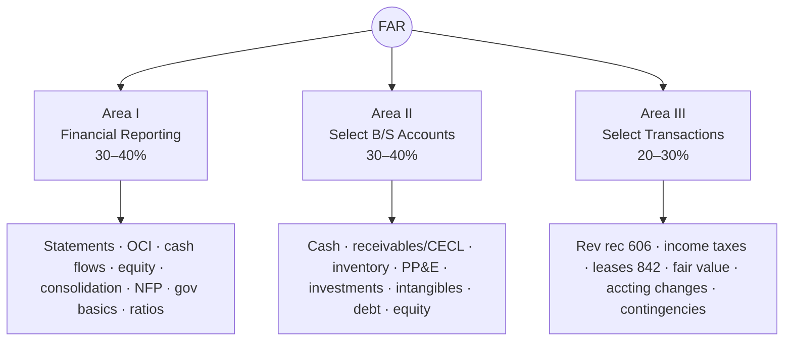
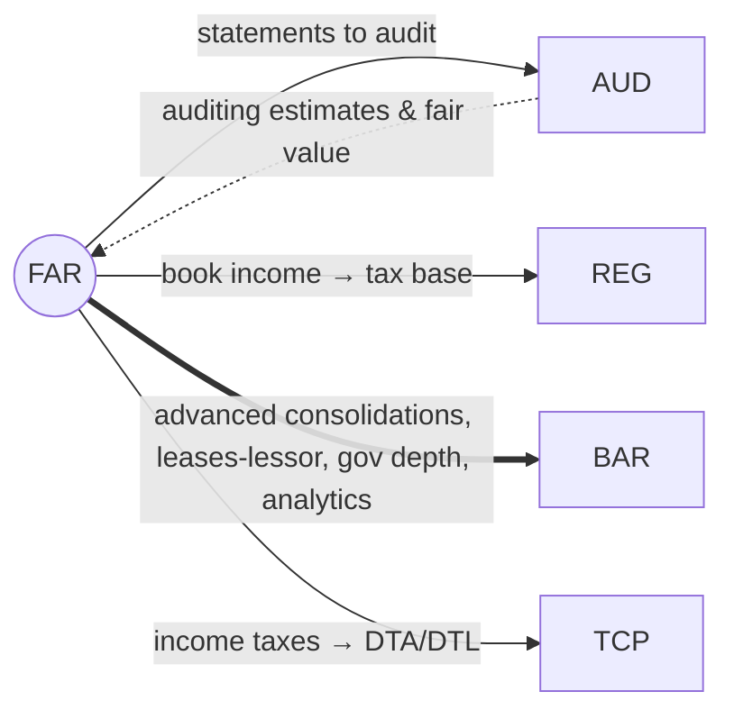

# FAR — Financial Accounting & Reporting (Core)

> The accounting engine. Everything AUD audits, REG/TCP taxes, and BAR analyzes starts here. Broadest Core
> section and historically the lowest Core pass rate — study it first, study it deepest.

---

## 1. Snapshot

| Attribute | Detail |
|---|---|
| Status | **Core** (required) |
| Length / format | 4 hours · **50 MCQ + 7 TBS** · 50% MCQ / 50% TBS |
| Skill emphasis | **Application-dominant**, then Analysis; relatively little pure memorization (R&U ~5–15%) |
| Governing authorities | **FASB ASC**, SEC reporting, selected AICPA special-purpose frameworks, **GASB** (foundational gov), NFP guidance |
| Recent pass rate (Q1 2026, context) | ~**43%** — lowest among AUD/FAR/REG |
| Recommended hours | **130–150** (add 20–40 if JEs, leases, deferred taxes, or gov/NFP are weak) |

**Why it's hard:** FAR is wide *and* document-based. TBSs hand you trial balances, source documents, and
schedules and expect you to **prepare, reconcile, and correct** — not just recognize a definition.

---

## 2. Blueprint area breakdown (2026)

> Weights are ranges; AICPA does not publish fixed per-form counts.

### Area I — Financial Reporting · **30–40%**
General-purpose financial reporting frameworks and the statements themselves.
- Conceptual framework & standard-setting; general-purpose F/S for **for-profit** entities
- **Statement of comprehensive income** / OCI; **statement of changes in equity**
- **Statement of cash flows** (direct & indirect; operating/investing/financing classification)
- **Consolidated** financial statements (basics)
- **Notes/disclosures**; ratios & performance metrics
- **Not-for-profit (NFP)** financial statements
- **State & local government** financial reporting — *foundational* (BAR goes deeper)
- Public-company reporting (SEC); employee benefit plan F/S

**Learning objectives:** prepare/correct statements, reconcile source data to statements, spot disclosure
inconsistencies, compute & interpret ratios and budget-to-actual variances.

### Area II — Select Balance Sheet Accounts · **30–40%**
Recognition, measurement, and rollforwards of specific accounts (FASB ASC).
- **Cash** & bank reconciliations; **trade receivables** (expected credit losses / CECL, returns & allowances)
- **Inventory** (costing methods, lower-of-cost-or-NRV/market)
- **PP&E** (capitalization, depreciation, impairment, held-for-sale)
- **Investments** (fair value, amortized cost, equity method basics)
- **Intangibles** (finite-lived amortization; goodwill basics)
- **Payables & accrued liabilities**; **long-term debt** (discounts/premiums, effective interest), **debt covenants**
- **Equity** (common/preferred, treasury stock, stock dividends/splits)

**Learning objectives:** calculate carrying amounts, prepare JEs, roll forward accounts, reconcile
subledgers to GL, evaluate covenant compliance.

### Area III — Select Transactions · **20–30%**
Cross-cutting transactions and events.
- **Accounting changes & error corrections** (prospective vs. retrospective vs. restatement)
- **Contingencies & commitments**
- **Revenue recognition** — the **ASC 606 five-step model**, contract costs
- **Income taxes** — DTA/DTL, valuation allowance, permanent vs. temporary differences
- **Leases (ASC 842)** — lessee classification & measurement
- **Fair value measurement** — hierarchy (Levels 1–3) & techniques
- **Business combinations** (intro); **derivatives & hedging** (intro); **foreign currency** (intro)
- **Subsequent events**; NFP contributions & pledges; R&D and software cost basics; IFRS vs. US GAAP differences

**Learning objectives:** determine recognition/timing/measurement/disclosure, derive statement effects,
prepare supporting entries and note impacts.

---

## 3. High-yield clusters (where pass/fail is decided)

1. **Cash flow statement (indirect method)** — reconcile NI to operating cash; classify correctly. Appears
   on nearly every form.
2. **Revenue recognition (ASC 606)** — the five steps cold; variable consideration; contract costs.
3. **Leases (ASC 842, lessee)** — finance vs. operating; ROU asset & lease liability; remeasurement.
4. **Income taxes** — book-to-tax differences → DTA/DTL → valuation allowance. (Bridges to REG/TCP.)
5. **Consolidations** — eliminations, NCI basics (BAR deepens this).
6. **Bonds/long-term debt** — effective-interest amortization, discount/premium rollforwards.
7. **Governmental & NFP basics** — fund types, government-wide vs. fund statements, donor restrictions.
8. **PP&E & intangibles** — capitalize vs. expense, depreciation/amortization, impairment.

> If you can do these eight fluently *from documents* (not flash cards), you have most of FAR's points.

---

## 4. Connections (how FAR plugs into the web)

- **→ AUD:** AUD audits FAR's outputs — assertions about the same accounts, fair-value estimates, going concern.
- **→ REG/TCP:** FAR book income is the *starting point* for the Schedule M book-to-tax reconciliation.
- **→ BAR:** BAR is "FAR, leveled up" — advanced consolidations/intercompany, **lessor** accounting,
  derivatives/hedging depth, full governmental statements, plus financial analysis.
- **Reused threads:** revenue recognition, leases, fair value, gov/NFP — see [`../roadmap/01-master-roadmap.md`](../roadmap/01-master-roadmap.md) §4.

---

## 5. Representative TBS types

- Build financial statements **from a trial balance**; post adjusting entries first.
- **Bank reconciliation** TBS; reconcile subledger to GL.
- **Consolidation** worksheet with eliminations / NCI.
- **Revenue contract** analysis (apply the five steps to a fact pattern).
- **Deferred tax** schedule from book-to-tax differences.
- **Fair-value measurement** case; **debt amortization** rollforward.
- **NFP statement of activities** or **governmental** fund/government-wide reconciliation.

---

## 6. Common pitfalls & the hard truth

| Pitfall | Hard truth | Fix |
|---|---|---|
| Memorizing mnemonics without mechanics | FAR punishes shallow memorization fast; TBSs are document-based | Rebuild everything through **JEs → rollforwards → statement effects** |
| Weak statement linkage | A change in one account ripples to others & to cash flows | Practice "transaction → all-statement impact" reps |
| Treating gov/NFP as optional | It's foundational and frequently tested | Lock the fund categories & reconciliation logic early |
| Cash flow guesswork | Classification + sign errors lose easy points | Drill indirect-method add-backs to instant recall |

---

## 7. Resources for FAR

- **Official first:** AICPA 2026 FAR Blueprint; **FASB ASC** (`asc.fasb.org`); the **retired FAR TBS** the
  AICPA released (rare long-form simulation example); AICPA sample test.
- **Gov/NFP authority:** **GASB** (`gasb.org`) teaching resources.
- **Real-world context:** **SEC EDGAR** filings to see live statements & disclosures.
- **Text (if foundation weak):** Kieso *Intermediate Accounting* or Spiceland; Hoyle *Advanced Accounting*
  (consolidations); Granof (gov/NFP).
- **Review course:** any major bank for MCQ/TBS volume — see [`../resources/01-resource-stack.md`](../resources/01-resource-stack.md).

---

## 8. Deeper-research TODO (push from "covered" → "mastered")

- [ ] Pull the **exact Area I–III topic lists** verbatim from the official 2026 blueprint PDF and check off coverage.
- [ ] Build a one-page **ASC 606 five-step** decision flow with 5 worked variable-consideration examples.
- [ ] Build a **lease (842) lessee** decision tree + ROU/liability rollforward template.
- [ ] Create a **book-to-tax bridge** worksheet that hands off cleanly to [`core-REG.md`](core-REG.md).
- [ ] Assemble **gov vs. NFP** statement-name cheat sheet + reconciliation diagram (feeds [`discipline-BAR.md`](discipline-BAR.md)).
- [ ] Collect 3–5 **EDGAR** 10-K disclosures (leases, revenue, income taxes) as real-document TBS practice.

_Last researched: 2026-06-07 · Verify weights against the live AICPA 2026 Blueprint._
