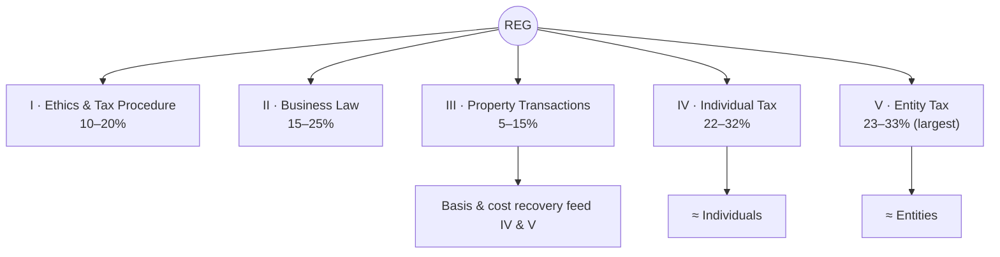
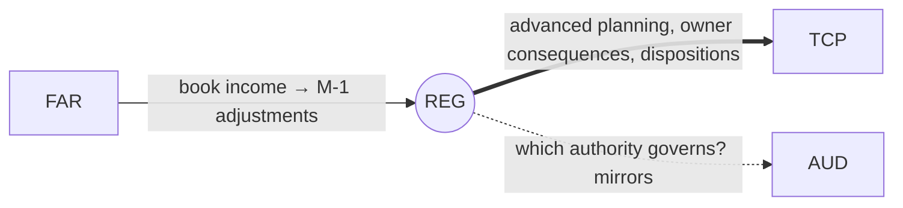

# REG — Taxation & Regulation (Core)

> Tax + business law + ethics/procedure. REG rewards **structural thinking** over memorizing tables. The
> exam tests whether you can move from a fact pattern to the correct **tax consequence** — basis,
> characterization, entity flow-through, and book-to-tax logic — not whether you can recite phaseouts.

---

## 1. Snapshot

| Attribute | Detail |
|---|---|
| Status | **Core** (required) |
| Length / format | 4 hours · **72 MCQ + 8 TBS** (most TBSs of any section) · 50% MCQ / 50% TBS |
| Skill emphasis | R&U 25–35 (ethics/law) · **Application 35–45** · Analysis 25–35 (tax areas) |
| Governing authorities | **IRC**, Treasury regs, **Circular 230**, federal business law, AICPA ethics |
| Recent pass rate (Q1 2026, context) | ~**67%** — highest among the three Cores |
| Recommended hours | **90–110** (add 15–25 if basis, entity tax, or business law are weak) |

**Not tested:** memorizing indexed/inflation amounts. **Heavily tested:** structure, **basis**,
characterization, procedure, reporting, and **entity-specific consequences**.

---

## 2. Blueprint area breakdown (2026)

### Area I — Ethics, Professional Responsibilities & Federal Tax Procedures · **10–20%**
- **Circular 230**; preparer rules & penalties; state board authority
- **IRS audits, appeals & courts**; substantiation & disclosure; **FBAR**-type requirements
- Taxpayer penalties; **hierarchy of authority**; common-law duties; **privilege/confidentiality/privacy**

### Area II — Business Law · **15–25%**
- **Agency**; **contracts** (formation/discharge/remedies)
- **Debtor-creditor** relations; **secured transactions**; **bankruptcy**
- Federal laws & regulations; **worker classification**; **anti-bribery (FCPA)**
- **Business structure** — entity formation/termination; owner & management rights and duties

### Area III — Federal Taxation of Property Transactions · **5–15%** (smallest)
- **Basis** of business-use assets; personal-to-business conversion basis; basis of assets held by individuals
- **Intangibles**; **depreciation & amortization** (MACRS, §179, bonus); routine property-tax consequences
- Gains/losses, character (capital vs. ordinary), recurring dispositions

### Area IV — Federal Taxation of Individuals · **22–32%**
- **Gross income**, exclusions, **AGI**, taxable income; itemized vs. standard
- **Pass-through items** on individual returns (K-1s); **loss limitations** (basis/at-risk/passive)
- Filing status; **credits**; **estimated-tax** safe harbors

### Area V — Federal Taxation of Entities · **23–33%** (largest)
- **C corporations** — taxable income, book-to-tax (**Schedule M-1/M-3**), E&P, distributions
- **S corporations** — eligibility/election, shareholder **basis** ordering, separately stated items
- **Partnerships/LLCs** — partner **basis**, inside/outside basis, ordinary vs. separately stated, distributions
- **Tax-exempt** organizations; entity **return-preparation review**

> **Effort signal:** Areas IV + V (individual + entity tax) are **~45–65%** combined — most of your time
> goes here. Property (Area III) is small but its **basis** machinery powers IV and V.

---

## 3. High-yield clusters (REG is won on these)

1. **Basis** — the single most reused number: asset basis, **partner outside basis**, **S-corp stock basis
   ordering**, C-corp E&P. Most points are lost here.
2. **Entity flow-through consequences** — separately stated vs. ordinary; how items hit the owner's return.
3. **Book-to-tax (Schedule M-1)** — permanent vs. temporary differences (bridges from **FAR** income taxes).
4. **Property transactions & character** — §1231/1245/1250 recapture, capital vs. ordinary, basis & holding period.
5. **Individual income** — gross income inclusions/exclusions, AGI, loss limitation ordering (basis→at-risk→passive).
6. **Preparer & professional responsibility** — Circular 230, penalties, disclosure thresholds, privilege.
7. **Contracts & debtor-creditor / bankruptcy** — the densest, most-tested business-law clusters.

---

## 4. Connections (how REG plugs into the web)

- **← FAR:** FAR's **income taxes (DTA/DTL)** and book income are the launch point for REG's book-to-tax
  reconciliation. The same temporary/permanent difference concept lives in both.
- **→ TCP:** TCP is "REG, leveled up" — advanced individual planning, owner-level entity consequences,
  trusts/gifts/estates, and sophisticated property dispositions. **REG → TCP is the natural Discipline path
  for tax people.**
- **↔ AUD:** the authority-selection skill (Circular 230 vs. AICPA Code) parallels AUD's independence analysis.
- **Reused threads:** basis, book-to-tax, ethics — [`../roadmap/01-master-roadmap.md`](../roadmap/01-master-roadmap.md) §4.

---

## 5. Representative TBS types

- **Circular 230 / preparer-penalty** MCQ; TBS identifying sufficient **substantiation & disclosure**.
- MCQ-heavy **business-law scenario sets**; TBS on **entity structure / legal obligations**.
- **Basis & depreciation** short TBS (MACRS, §179).
- **Individual return** schedule / **AGI** computation.
- **Entity return review** — C-corp taxable income, **K-1 effects**, partner/shareholder **basis** schedules.

---

## 6. Common pitfalls & the hard truth

| Pitfall | Hard truth | Fix |
|---|---|---|
| Memorizing rules without mastering basis/flow-through | REG is about structure & entity consequence, not tax-table trivia | Drill **basis schedules**, flow-through logic, and **M-1** adjustments |
| Treating business law as an afterthought | It's 15–25% and very rule-dense | Build contract/agency/bankruptcy rule grids |
| Confusing C-corp vs. S-corp vs. partnership treatment | The entity is the whole question | Make a 3-column **entity comparison** chart |
| Reciting phaseout numbers | Not tested; wasted effort | Spend that time on consequence logic |

---

## 7. Resources for REG

- **Official first:** AICPA 2026 REG Blueprint; **IRS.gov** (forms, instructions, publications), **Circular
  230**, Office of Professional Responsibility; AICPA sample test.
- **Text (if needed):** *South-Western Federal Taxation* (Individual + Entities volumes).
- **Practice:** review-course MCQ/TBS bank for basis and entity reps (where most candidates need volume).

---

## 8. Deeper-research TODO

- [ ] Build the **basis master sheet**: asset basis · partner outside basis · S-corp stock basis ordering · C-corp E&P.
- [ ] Build a **3-entity comparison** chart (C / S / partnership): formation, basis, income character, distributions, losses.
- [ ] Make a **loss-limitation ordering** flow (basis → at-risk → passive) with worked examples.
- [ ] Build an **M-1 book-to-tax** worksheet that connects to [`core-FAR.md`](core-FAR.md) income taxes.
- [ ] Assemble a **business-law rule grid** (contracts, agency, secured transactions, bankruptcy).
- [ ] Map which REG topics deepen in **TCP** to plan the Discipline handoff → [`discipline-TCP.md`](discipline-TCP.md).

_Last researched: 2026-06-07 · Verify weights against the live AICPA 2026 Blueprint._
