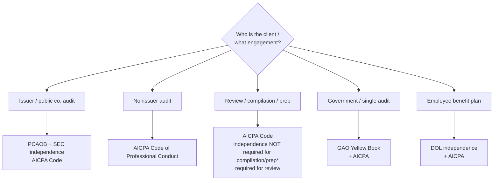
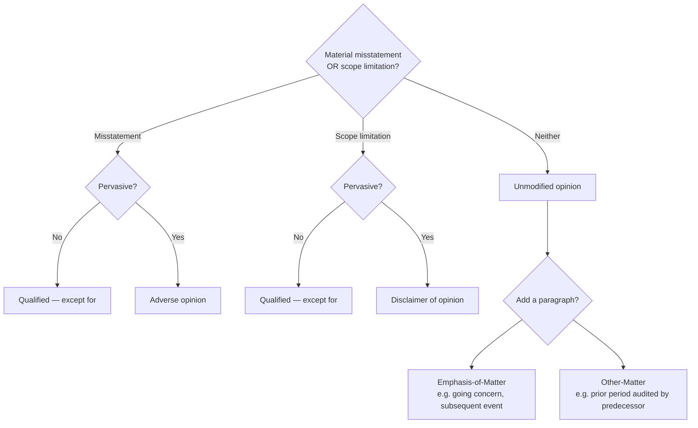
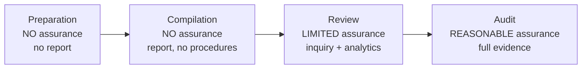
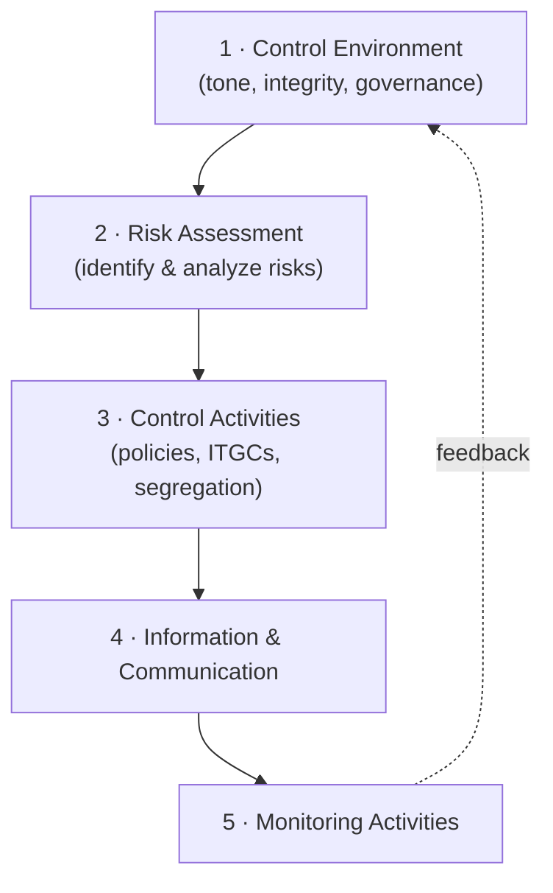

# AUD — Deep-Dive Artifacts

Exam-ready reference sheets for AUD's decision-heavy content. Builds on [`../core-AUD.md`](../core-AUD.md).

> Authorities: **AICPA** (SAS/SSAE/SSARS), **PCAOB AS** (issuers), **GAO Yellow Book**, **DOL** (EBP),
> **SEC** independence, **COSO**. Study aids — verify against the standards and the 2026 blueprint.

**Contents:** 1) Independence matrix · 2) Report decision tree · 3) Service grid (audit/review/comp/prep/
attest) · 4) COSO 5/17 · 5) Sampling quick reference.

---

## 1. Independence & "which authority governs?" matrix

The first move on almost every Area I item: identify the **engagement** → that fixes the **authority**.

\* Compilation/preparation: independence is **not required**, but lack of independence must be **disclosed**
on a compilation report. **Review** requires independence.

| Engagement | Governing independence rules | Independence required? |
|---|---|---|
| Issuer (public) audit | **SEC + PCAOB** (stricter), AICPA Code | Yes — strictest |
| Nonissuer audit | AICPA Code of Professional Conduct | Yes |
| Review (SSARS) | AICPA Code | Yes |
| Compilation (SSARS) | AICPA Code | No — but **disclose** if not independent |
| Preparation (SSARS) | AICPA Code | No (no report; no assurance) |
| Government / single audit | **GAO Yellow Book** + AICPA | Yes — plus Yellow Book nonaudit-service rules |
| Employee benefit plan | **DOL** + AICPA | Yes — DOL definition |

**Conceptual framework (threats → safeguards):** self-review, advocacy, adverse interest, familiarity,
undue influence, self-interest, management participation. If no safeguard reduces the threat to acceptable
→ independence is **impaired**. **Classic impairments:** financial interest in client, loans, doing
management functions, contingent fees, unpaid fees, business relationships.

---

## 2. Audit report decision tree (nonissuer, AICPA)

| Situation | Opinion |
|---|---|
| F/S fairly stated | **Unmodified** (nonissuer) / **Unqualified** (issuer wording) |
| Misstatement, **not** pervasive | **Qualified** ("except for") |
| Misstatement, **pervasive** | **Adverse** |
| Scope limitation, **not** pervasive | **Qualified** |
| Scope limitation, **pervasive** | **Disclaimer** |

**Report elements (nonissuer, current AICPA order):** Opinion section first → Basis for Opinion →
[Going Concern if applicable] → Key Audit Matters (if engaged) → Responsibilities of Management →
Auditor's Responsibilities. **Issuer (PCAOB)** reports include **Critical Audit Matters (CAMs)** and the
auditor **tenure** statement.

- **Emphasis-of-Matter (EOM):** appropriately presented in F/S but fundamental (going concern, major
  subsequent event, special-purpose framework).
- **Other-Matter (OM):** relevant to users' understanding but not in the F/S (e.g., prior period audited by
  a predecessor, restricting use).

---

## 3. Service grid — the assurance ladder (nonissuer)

| Service | Standard | Assurance | Procedures | Independence | Report conclusion |
|---|---|---|---|---|---|
| **Preparation** | SSARS | None | Prepare F/S only | Not required | No report ("no assurance" legend on each page) |
| **Compilation** | SSARS | None | Read for appropriateness | Not required (disclose if not) | No assurance expressed |
| **Review** | SSARS | **Limited** ("negative") | **Inquiry + analytical** procedures | **Required** | "not aware of material modifications" |
| **Audit** | SAS / PCAOB | **Reasonable** | Full risk-based evidence | Required | Opinion (see §2) |
| **Examination (attest)** | SSAE | Reasonable | On subject matter/assertion | Required | Opinion on subject matter |
| **Agreed-upon procedures** | SSAE | None (findings only) | Specified procedures | Required | Findings, **no opinion** |

> **Mnemonic for review limited assurance procedures: "I-A" = Inquiry + Analytics.** Audits add corroboration,
> observation, confirmation, recalculation, inspection.

---

## 4. COSO Internal Control — 5 components / 17 principles

| Component | Core idea | Example controls |
|---|---|---|
| **Control Environment** | Foundation: integrity, board oversight, structure, competence, accountability | Code of conduct, audit committee, HR policies |
| **Risk Assessment** | Set objectives; identify/analyze risks incl. fraud & change | Risk register, fraud-risk assessment |
| **Control Activities** | Actions that mitigate risk; **ITGCs** + application controls; **segregation of duties** | Approvals, reconciliations, access controls |
| **Information & Communication** | Relevant quality info, internal & external | Reporting systems, whistleblower line |
| **Monitoring** | Ongoing + separate evaluations; report deficiencies | Internal audit, management review |

**Deficiency severity:** **Deficiency** → **Significant deficiency** (important enough for those charged
with governance) → **Material weakness** (reasonable possibility of material misstatement not prevented/
detected). This bridges directly to **ISC** — see [`discipline-ISC-deep-dive.md`](discipline-ISC-deep-dive.md) if built.

---

## 5. Sampling quick reference

| | **Attributes sampling** | **Variables sampling** |
|---|---|---|
| Tests | **Controls** (rate of deviation) | **Substantive** (dollar misstatement) |
| Answers | "How often does the control fail?" | "Is the balance materially misstated?" |
| Output | Deviation rate vs. tolerable rate | Projected misstatement vs. tolerable misstatement |
| Methods | — | MUS/PPS (dollar-unit), classical variables |

**Sample-size drivers (direction of effect):**

| Factor increases → | Attributes sample size | Variables sample size |
|---|---|---|
| Higher desired confidence (lower risk) | ↑ | ↑ |
| Higher tolerable rate / tolerable misstatement | ↓ | ↓ |
| Higher expected deviation / misstatement | ↑ | ↑ |
| Larger variability (std dev) | — | ↑ |
| Population size | minimal effect | minimal effect |

**MUS/PPS notes:** automatically biases toward **larger dollar items**; great for **overstatement**
testing; awkward for zero/negative balances and understatements.

**Evaluating results:** project misstatement to the population, add an allowance for sampling risk, compare
to tolerable misstatement; if projected + allowance > tolerable → likely materially misstated.

---

## Verify-later flags
- [ ] Confirm current AICPA report section ordering & KAM/CAM wording vs. latest SAS/PCAOB.
- [ ] Confirm Yellow Book & DOL independence nuances against current editions.
- [ ] Confirm SSARS independence-disclosure wording for compilations.

_Built 2026-06-07 from AICPA/PCAOB/COSO knowledge + AICPA 2026 blueprint structure._
