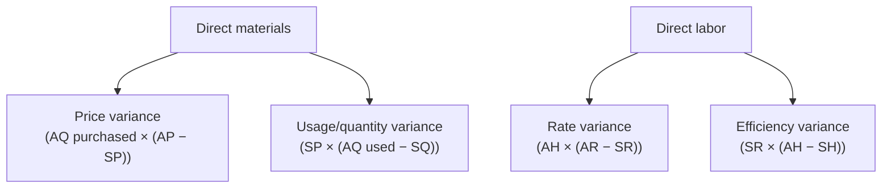
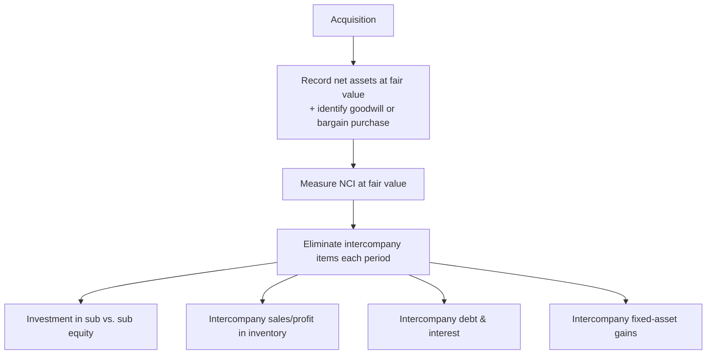
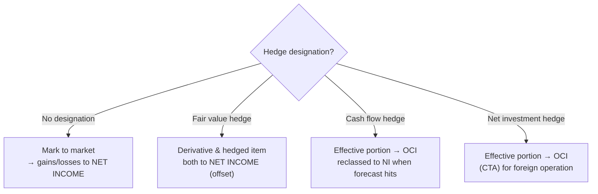

# BAR — Deep-Dive Artifacts (Discipline)

Exam-ready reference sheets for the broadest, most analysis-heavy Discipline. Builds on
[`../discipline-BAR.md`](../discipline-BAR.md).

> Authorities: **FASB ASC**, **GASB**, finance/managerial concepts. Not affected by OBBBA tax changes.
> Study aids — verify against the standards and the 2026 BAR blueprint.

**Contents:** 1) Ratio dictionary · 2) Cost/variance formulas · 3) Forecasting & breakeven · 4) Advanced
consolidations · 5) Derivatives & hedge accounting · 6) Government-wide ↔ fund reconciliation.

---

## 1. Ratio dictionary (Area I — compute *and* interpret)

BAR rewards interpretation, not just the number. For each ratio know **formula → what it diagnoses →
which direction is "better."**

| Category | Ratio | Formula | Diagnoses |
|---|---|---|---|
| **Liquidity** | Current ratio | Current assets / current liabilities | Short-term solvency |
| | Quick (acid-test) | (Cash + marketable sec. + A/R) / current liab. | Liquidity excluding inventory |
| | Working capital | Current assets − current liabilities | Cushion |
| **Activity** | A/R turnover | Net credit sales / avg. A/R | Collection speed |
| | Days sales outstanding | 365 / A/R turnover | Avg. collection days |
| | Inventory turnover | COGS / avg. inventory | Stock movement |
| | Days inventory | 365 / inventory turnover | Days to sell |
| | Asset turnover | Sales / avg. total assets | Asset efficiency |
| **Solvency** | Debt-to-equity | Total liabilities / total equity | Leverage |
| | Times interest earned | EBIT / interest expense | Debt-service coverage |
| | Debt-to-total-assets | Total liabilities / total assets | Capital structure |
| **Profitability** | Gross margin | Gross profit / sales | Pricing/cost control |
| | Net profit margin | Net income / sales | Bottom-line efficiency |
| | Return on assets (ROA) | Net income / avg. total assets | Asset productivity |
| | Return on equity (ROE) | Net income / avg. equity | Owner return |
| **DuPont** | ROE | Net margin × asset turnover × **equity multiplier** | Decomposes ROE drivers |

> **DuPont:** `ROE = (NI/Sales) × (Sales/Assets) × (Assets/Equity)`. The exam loves asking *which lever*
> moved ROE.

---

## 2. Cost & variance analysis (managerial)

**Standard-cost variances — split each into price and quantity:**



| Variance | Formula | Favorable when |
|---|---|---|
| Materials **price** | AQ × (AP − SP) | Paid less than standard |
| Materials **usage** | SP × (AQ used − SQ allowed) | Used less than standard |
| Labor **rate** | AH × (AR − SR) | Paid lower wage than standard |
| Labor **efficiency** | SR × (AH − SH allowed) | Worked fewer hours than standard |
| Variable OH **spending** | actual − (AH × std VOH rate) | — |
| Variable OH **efficiency** | std VOH rate × (AH − SH) | — |
| Fixed OH **budget** | actual FOH − budgeted FOH | — |
| Fixed OH **volume** | budgeted FOH − applied FOH | — |

*(A = actual, S = standard, Q = quantity, P = price, H = hours, R = rate.)*

**Costing systems:** absorption (fixed OH in product cost) vs. variable/direct (fixed OH = period cost);
difference flows through inventory changes. **CVP:** `Contribution margin = Sales − variable costs`;
`CM ratio = CM / Sales`.

---

## 3. Forecasting, breakeven & capital decisions (Area I)

**Breakeven & target profit:**
```
Breakeven units      = Fixed costs / CM per unit
Breakeven dollars    = Fixed costs / CM ratio
Units for target π   = (Fixed costs + target profit) / CM per unit
Margin of safety     = Actual (or budgeted) sales − breakeven sales
Operating leverage   = Contribution margin / operating income
```

**Capital budgeting (compare investment alternatives):**

| Method | Rule | Note |
|---|---|---|
| **NPV** | Accept if NPV > 0 | Discounts cash flows at cost of capital; best method |
| **IRR** | Accept if IRR > hurdle rate | Rate where NPV = 0; multiple-IRR pitfalls |
| **Payback** | Shorter is better | Ignores time value & post-payback flows |
| **Profitability index** | PV of inflows / initial outlay | Ranking under capital rationing |

**Forecasting tools:** sensitivity analysis (flex one variable), scenario analysis (best/base/worst),
regression for cost behavior (high-low method: `variable rate = (cost_high − cost_low)/(units_high − units_low)`).

---

## 4. Advanced consolidations (Area II)



| Concept | Key mechanics |
|---|---|
| **Goodwill** | (Consideration + NCI fair value) − fair value of identifiable net assets; not amortized, **impairment-tested** |
| **Bargain purchase** | FV of net assets > consideration → **gain** to acquirer |
| **NCI (non-controlling interest)** | Reported in equity; gets its share of sub net income & FV adjustments |
| **Intercompany inventory** | Defer **unrealized profit** in ending inventory until sold to outsiders (downstream vs. upstream affects NCI) |
| **Intercompany fixed assets** | Defer gain; realize over remaining life via depreciation adjustment |
| **Intercompany debt** | Eliminate payable/receivable & interest; recognize gain/loss on constructive retirement |
| **Step acquisition** | Remeasure prior equity interest to fair value at control date (gain/loss to income) |

---

## 5. Derivatives & hedge accounting (Area II — high difficulty, high yield)



| Hedge type | Hedges | Effective portion goes to |
|---|---|---|
| **Fair value** | Exposure to changes in fair value of a recognized asset/liability or firm commitment | **Net income** (both sides) |
| **Cash flow** | Variability of future cash flows (e.g., forecasted purchase, variable-rate debt) | **OCI**, reclassified to NI when the hedged item affects earnings |
| **Net investment** | FX exposure of a net investment in a foreign operation | **OCI** (cumulative translation adjustment) |

**Derivative basics:** notional + underlying, little/no initial net investment, net settlement. Carried at
**fair value**. Embedded derivatives may require bifurcation.

---

## 6. Government-wide ↔ fund reconciliation (Area III)

The most reliable BAR governmental TBS: bridge **modified-accrual fund** statements to **full-accrual
government-wide** statements.


| Reconciling item | Why it adjusts |
|---|---|
| **Capital assets** | Funds expense capital outlay; government-wide capitalizes & depreciates → **add** |
| **Long-term debt** | Not in fund balance sheet; government-wide reports it → **subtract** |
| **Accrued interest / compensated absences** | Recognized on accrual basis only → **subtract** |
| **Internal service funds** | Usually folded into governmental activities → **add** net position |
| **Deferred inflows (unavailable revenue)** | Available in funds vs. earned in gov-wide → **adjust** |

**Revenue/expenditure reconciliation (operating statement):** start with fund "change in fund balance" →
add capital outlay, subtract depreciation, adjust for debt proceeds/principal, accrual revenues/expenses →
arrive at government-wide "change in net position."

**Fund categories quick recall:** Governmental (GF, Special Revenue, Capital Projects, Debt Service,
Permanent) · Proprietary (Enterprise, Internal Service) · Fiduciary (Custodial, Pension/OPEB, Investment,
Private-purpose).

---

## Verify-later flags
- [ ] Confirm BAR Area weights (I 40–50 / II 35–45 / III 10–20) & skill split vs. live 2026 blueprint.
- [ ] Confirm which advanced ASC topics (derivatives, lessor, software, share-based comp) are in-scope vs. FAR.
- [ ] Cross-check GASB reconciliation items against current GASB statements.

_Built 2026-06-07 from FASB ASC / GASB / managerial-finance knowledge + AICPA 2026 blueprint structure._
