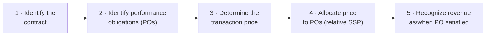
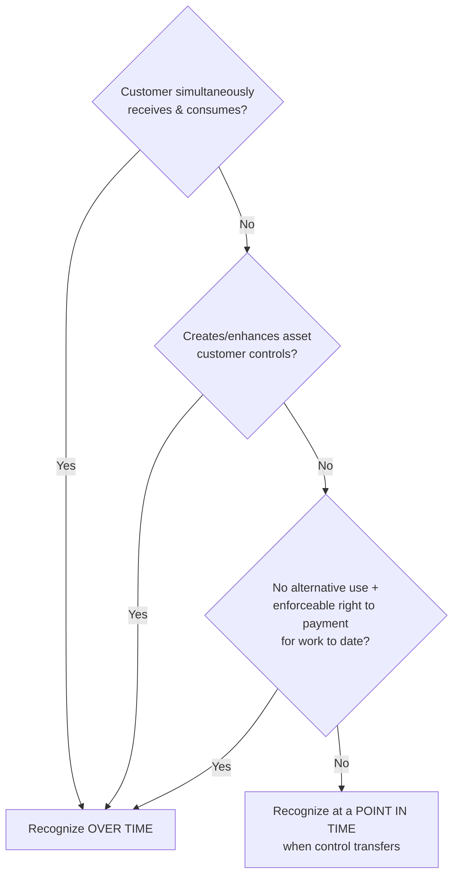
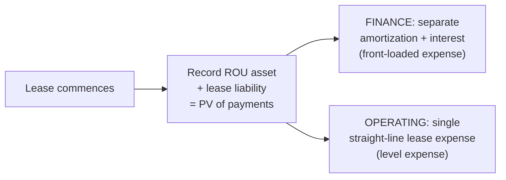
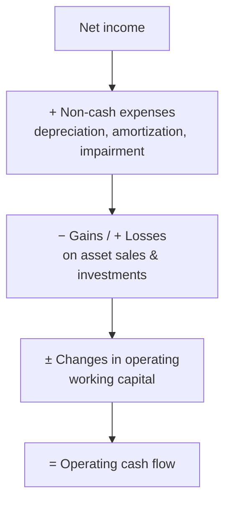
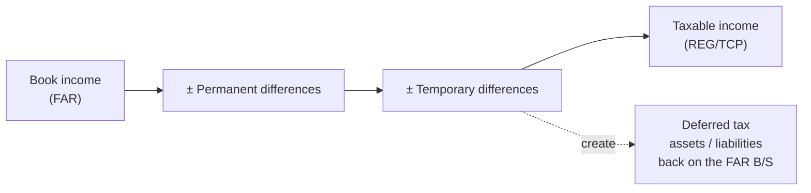
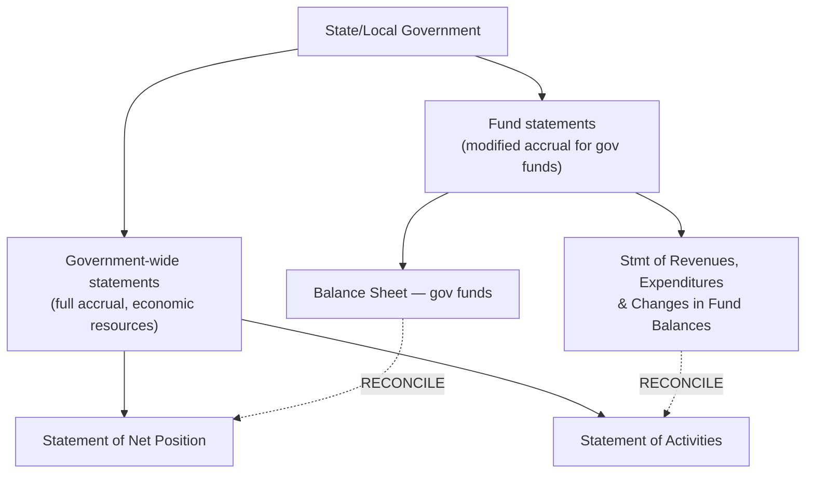

# FAR — Deep-Dive Artifacts

Concrete, exam-ready reference sheets for FAR's highest-yield topics. These build on
[`../core-FAR.md`](../core-FAR.md) and turn its "Deeper-research TODO" into usable tools.

> Authority: **FASB ASC**. Verify any standard against `asc.fasb.org` and the AICPA 2026 Blueprint. These
> are study aids, not citations.

**Contents:** 1) ASC 606 revenue · 2) ASC 842 leases (lessee) · 3) Cash flows (indirect) · 4) Book-to-tax
bridge (→ REG) · 5) Governmental vs. NFP cheat sheet.

---

## 1. Revenue Recognition — ASC 606 five-step model

| Step | What you decide | Watch-outs (commonly tested) |
|---|---|---|
| **1 — Contract** | Approval, rights, payment terms, commercial substance, collection *probable* | No contract until collection is probable; combine contracts when interdependent |
| **2 — Performance obligations** | Distinct goods/services (capable of being distinct *and* distinct in context) | Bundle vs. separate; series of distinct goods = single PO |
| **3 — Transaction price** | Fixed + **variable consideration** + financing + noncash + consideration payable to customer | Variable consideration uses **expected value** or **most likely amount**; apply the **constraint** (only to the extent highly probable no significant reversal) |
| **4 — Allocate** | Split price by **relative standalone selling price (SSP)** | Discounts/variable consideration may be allocated to specific POs if criteria met |
| **5 — Recognize** | **Over time** (one of 3 criteria) vs. **point in time** | Over-time criteria: (a) customer consumes as you perform, (b) creates/enhances an asset the customer controls, (c) no alternative use **+** enforceable right to payment |

**Over-time vs. point-in-time test:**

**Worked micro-examples (variable consideration):**
1. **Volume rebate:** Sell at $100/unit, 10% rebate if buyer exceeds 1,000 units and it's highly probable they will → record revenue at **$90** (expected value), liability for the rebate.
2. **Right of return:** Estimate returns; recognize revenue **net of expected returns**, record a refund liability and an asset for the right to recover goods.
3. **Performance bonus (most likely amount):** $500k fixed + $50k bonus if delivered early; if early delivery is most likely → price = **$550k**, constrained if a significant reversal is possible.
4. **Significant financing component:** Payment due 2 years after delivery → separate the **interest** from revenue (impute a rate).
5. **Consideration payable to customer (slotting fee):** Treated as a **reduction of revenue** unless it's for a distinct good/service.

> **TBS tip:** the exam loves step 3 (variable consideration + constraint) and step 5 (over-time vs.
> point-in-time). Drill those two.

---

## 2. Leases — ASC 842 (lessee)

**Classification (lessee): finance vs. operating.** Finance if **any ONE** of the five criteria is met
(think "OWNES" — Ownership, Written purchase option reasonably certain, Net present value, Economic life,
Specialized asset):

| # | Criterion | Finance if… |
|---|---|---|
| 1 | **O**wnership transfer | Title transfers at end of term |
| 2 | **W**ritten bargain/purchase option | Reasonably certain to exercise |
| 3 | **N**PV of payments | ≥ substantially all (~90%) of fair value |
| 4 | **E**conomic life | Lease term ≥ major part (~75%) of remaining life |
| 5 | **S**pecialized | Asset has no alternative use to lessor at end |

If none met → **operating lease**.

**Both types** put a **Right-of-Use (ROU) asset** and a **lease liability** on the balance sheet
(initial = PV of lease payments). The difference is the **income-statement pattern**:

| | Finance lease | Operating lease |
|---|---|---|
| B/S at start | ROU asset = lease liability = PV of payments | Same |
| Expense pattern | **Amortization** (straight-line ROU) **+ interest** (effective interest on liability) = **front-loaded** | **Single** straight-line lease expense |
| Cash flow | Interest = operating (or financing per policy); principal = financing | Lease payments = operating |
| Liability rollforward | Beg. liability × rate = interest; payment − interest = principal reduction | Same liability mechanics; expense plugged to straight-line |

**Lease liability rollforward (both):** `Ending = Beginning + interest − payment`.
**ROU amortization (finance):** straight-line over shorter of lease term / useful life (longer if ownership
transfers).

---

## 3. Statement of Cash Flows — indirect method quick sheet

Start with **net income**, adjust to **operating cash flow**:

| Item | Adjustment to NI (operating) | Memory rule |
|---|---|---|
| Depreciation / amortization / impairment | **+** | Non-cash, add back |
| Gain on sale of asset | **−** (and put full proceeds in investing) | Remove from operating |
| Loss on sale | **+** | Add back |
| ↑ Accounts receivable | **−** | Asset up = cash down |
| ↓ Accounts receivable | **+** | Asset down = cash up |
| ↑ Inventory | **−** | Asset up = cash down |
| ↑ Prepaid expenses | **−** | Asset up = cash down |
| ↑ Accounts payable | **+** | Liability up = cash up |
| ↑ Accrued liabilities | **+** | Liability up = cash up |
| ↑ Deferred revenue | **+** | Liability up = cash up |

**Classification map:**

| Activity | Includes |
|---|---|
| **Operating** | Cash from core ops; interest received/paid & dividends received (US GAAP) |
| **Investing** | Buy/sell PP&E & investments; **full proceeds** from asset sales; loans made |
| **Financing** | Debt issued/repaid (principal), stock issued/repurchased, **dividends paid** |

> **Trap:** the *gain/loss* is operating-statement noise; the **whole proceeds** go to investing. Don't
> double-count.

---

## 4. Book-to-Tax Bridge (Schedule M-1) — the FAR → REG handoff

FAR gives you **book income**. REG/TCP start from it and reconcile to **taxable income**. Master the
permanent vs. temporary distinction.

| Difference | Type | Book vs. tax | Creates DTA/DTL? |
|---|---|---|---|
| Municipal bond interest | **Permanent** | Book income, never taxable | No |
| 50% meals (nondeductible portion) | **Permanent** | Book expense, not deductible | No |
| Fines/penalties | **Permanent** | Book expense, never deductible | No |
| Federal income tax expense | **Permanent** | Book expense, not deductible | No |
| Depreciation (MACRS > book) | **Temporary** | Tax deduction now, reverses later | **DTL** |
| Warranty/bad-debt accrual | **Temporary** | Book expense now, deduct when paid | **DTA** |
| Deferred (unearned) revenue | **Temporary** | Taxed when received, booked when earned | **DTA** |
| Net operating loss carryforward | **Temporary** | Future deduction | **DTA** (assess valuation allowance) |

- **DTL** = taxable income will be *higher* later (e.g., accelerated tax depreciation reverses).
- **DTA** = taxable income will be *lower* later (e.g., accruals deductible when paid). Test for a
  **valuation allowance** if realization isn't more-likely-than-not.

Continues in [`REG-deep-dive.md`](REG-deep-dive.md) §3.

---

## 5. Governmental vs. NFP — statement cheat sheet

### Governmental (GASB) — dual perspective

| | Government-wide | Governmental funds |
|---|---|---|
| Basis | Full accrual | **Modified** accrual |
| Focus | Economic resources | Current financial resources |
| Revenue | When earned | When **measurable & available** |
| Long-term assets/debt | On the statement | **Not** on fund balance sheet |
| Why reconcile | Capital assets & LT debt + accrual adjustments bridge the two | Classic TBS |

**Fund categories:** **Governmental** (General, Special Revenue, Capital Projects, Debt Service,
Permanent), **Proprietary** (Enterprise, Internal Service), **Fiduciary** (Custodial, Pension/OPEB trust,
Investment trust, Private-purpose trust).

### NFP (FASB ASC 958)

| Statement | Key feature |
|---|---|
| Statement of Financial Position | Net assets in **two classes**: **with** vs. **without donor restrictions** |
| Statement of Activities | Revenue, expenses, **release from restriction** (reclassification) |
| Statement of Cash Flows | Same categories as for-profit (with NFP nuances) |
| Statement of Functional Expenses | Expenses by **function** (program/support) **and** natural classification |

**Donor restriction logic:** contributions recorded when the unconditional promise is made; restrictions
release to "without donor restrictions" when satisfied (purpose or time).

---

## Verify-later flags
- [ ] Confirm CECL (ASC 326) and lease (ASC 842) emphasis against the live 2026 FAR blueprint.
- [ ] Confirm no 2026 blueprint change to revenue/leases representative tasks.
- [ ] Spot-check over-time recognition criteria wording against ASC 606-10-25-27.

_Built 2026-06-07 from FASB ASC knowledge + AICPA 2026 blueprint structure. Cross-checks welcome._
