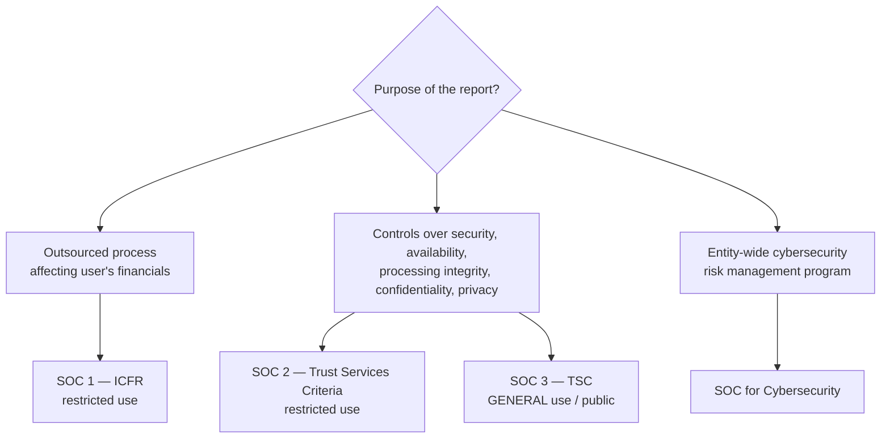
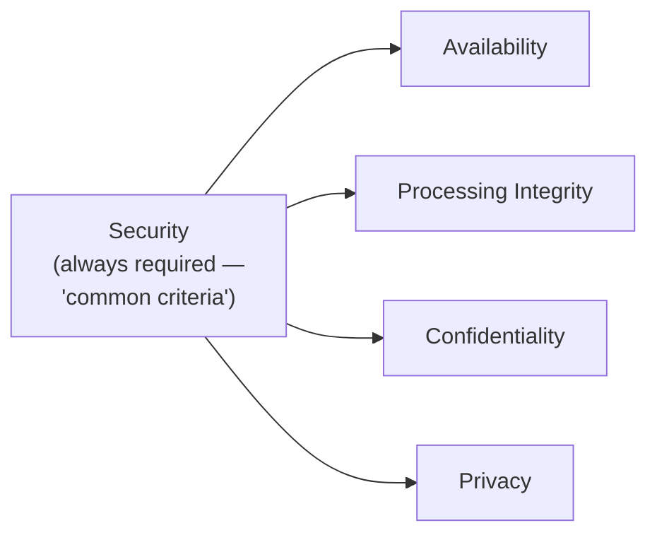
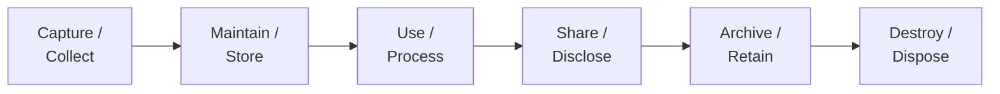

# ISC — Deep-Dive Artifacts (Discipline)

Exam-ready reference sheets for the IT-audit Discipline. The most **recall-heavy** section (R&U 55–65%) and
the only **60/40 MCQ/TBS** split — so MCQ accuracy and crisp terminology matter most. Builds on
[`../discipline-ISC.md`](../discipline-ISC.md).

> Authorities: **AICPA SOC/SSAE**, **Trust Services Criteria**, **NIST**, **COBIT**, **CIS**, privacy regs.
> Not affected by OBBBA. Study aids — verify against the 2026 ISC blueprint.

**Contents:** 1) SOC matrix · 2) Trust Services Criteria · 3) Framework comparison · 4) Data life cycle ·
5) IAM / access control · 6) Privacy-regime comparison.

---

## 1. SOC report matrix (Area III — the signature ISC topic)

| Report | Subject | Criteria | Users | Type 1 vs. 2 |
|---|---|---|---|---|
| **SOC 1** | Controls at a service org relevant to **user ICFR** | Control objectives (management-defined) | User entities & their auditors (**restricted**) | Both |
| **SOC 2** | Controls over **security/availability/processing integrity/confidentiality/privacy** | **Trust Services Criteria** | Knowledgeable parties (**restricted**) | Both |
| **SOC 3** | Same scope as SOC 2 | TSC | **General/public** (seal) | Type 2 only |
| **SOC for Cybersecurity** | Entity-wide cyber risk program | Description + control criteria | Broad | — |

| | **Type 1** | **Type 2** |
|---|---|---|
| Covers | Design **at a point in time** | Design **+ operating effectiveness over a period** |
| Opinion on | Suitability of design | Design **and** operating effectiveness |

**Service-organization concepts:**
- **Subservice organizations:** **carve-out** (excluded from description, CUECs noted) vs. **inclusive**
  (included in the report).
- **CUECs** = Complementary **User-Entity** Controls — controls the *user* must implement for the service
  org's controls to work.
- **CSOCs** = Complementary **Subservice-Organization** Controls.
- **Description criteria** = standards for a fair SOC 2 system description.

---

## 2. Trust Services Criteria (TSC) — the 5 categories

| Category | Question it answers |
|---|---|
| **Security** (mandatory baseline) | Is the system protected against unauthorized access (physical & logical)? |
| **Availability** | Is the system available for operation/use as committed? |
| **Processing Integrity** | Is processing complete, valid, accurate, timely, authorized? |
| **Confidentiality** | Is information designated as confidential protected? |
| **Privacy** | Is **personal** information collected/used/retained/disclosed per commitments? |

> Security = the **common criteria** present in every SOC 2; the other four are added only if in scope.
> **Confidentiality vs. Privacy:** confidentiality = any sensitive business info; privacy = **personal**
> information specifically.

---

## 3. Framework comparison (Area II)

| Framework | Owner | Purpose / scope | When referenced |
|---|---|---|---|
| **NIST CSF 2.0** | NIST | Voluntary cybersecurity risk framework | Org-wide cyber risk management |
| **NIST Privacy Framework** | NIST | Privacy risk management companion to CSF | Privacy programs |
| **COBIT** | ISACA | IT **governance & management** of enterprise IT | Aligning IT to business goals, IT controls |
| **CIS Controls** | Center for Internet Security | Prioritized, prescriptive **technical safeguards** | Hardening, defense baselines |
| **COSO** | COSO | Enterprise internal control / ERM | Entity-level control context (AUD bridge) |
| **ISO 27001** | ISO | Information security management system (ISMS) | Certifiable security program |

**NIST CSF 2.0 — six functions:**

*Govern* is the function added in CSF **2.0** (wraps the other five with strategy, roles, oversight).

---

## 4. Data life cycle & data management (Area I)

| Stage | Key controls |
|---|---|
| Collect | Input validation, authorization, minimization (collect only what's needed) |
| Store | Encryption at rest, access controls, schema/data-model integrity, backups |
| Use/Process | Processing-integrity controls, change management, segregation of duties |
| Share | Encryption in transit, DLP, contractual/consent controls |
| Retain | Retention policy, legal holds |
| Destroy | Secure deletion / media sanitization |

**Data concepts to know:** structured vs. unstructured data; relational schema (PK/FK), normalization;
**data governance** (ownership, stewardship), **data quality** dimensions (accuracy, completeness,
consistency, timeliness); ETL; **SQL** basics (SELECT/JOIN/WHERE/GROUP BY) for data extraction. Systems:
on-prem vs. **cloud** (IaaS/PaaS/SaaS), **ERP/AIS**, blockchain risks, SDLC & **change management**.

---

## 5. Identity & Access Management (Area II)

| Concept | Definition |
|---|---|
| **AuthN (authentication)** | Proving *who you are* (password, MFA, biometrics) |
| **AuthZ (authorization)** | What you're *allowed to do* (permissions) |
| **Least privilege** | Minimum access necessary for the role |
| **Segregation of duties (SoD)** | Split incompatible functions (e.g., custody vs. recording vs. authorization) |
| **RBAC** | Role-based access control — permissions tied to roles |
| **Provisioning / deprovisioning** | Granting & promptly removing access (joiners/movers/leavers) |
| **Privileged access mgmt (PAM)** | Extra controls over admin/superuser accounts |

**Security controls families:** preventive / detective / corrective; physical / logical; network security
(firewalls, IDS/IPS, segmentation, VPN); **encryption** (symmetric vs. asymmetric, hashing, PKI/certs);
**incident response** lifecycle (prepare → identify → contain → eradicate → recover → lessons learned).

---

## 6. Privacy-regime comparison (Area II)

| Regime | Scope | Key obligations |
|---|---|---|
| **HIPAA** | U.S. **health** information (PHI) | Privacy & Security Rules; safeguards; breach notification |
| **GDPR** | **EU** personal data (extraterritorial) | Lawful basis, data-subject rights, DPO, 72-hr breach notice, large fines |
| **PCI-DSS** | **Payment-card** data | 12 requirements; cardholder-data environment controls (contractual, not law) |
| **CCPA/CPRA** | California consumers | Disclosure, opt-out of sale, access/deletion rights |
| **GLBA** | U.S. **financial** institutions' customer data | Safeguards Rule, privacy notices |

> **Confidentiality vs. privacy (again):** privacy law governs **personal** data specifically; map each
> regime to the **data type** it protects.

---

## ISC strategy reminders
- **MCQs are 60%** — drill the framework/SOC/privacy terminology to fast, accurate recall.
- **Map every acronym to a process, risk, and control objective** — the exam tests *application in
  context*, not flashcard definitions alone.
- The **COSO / ITGC** bridge from AUD is your fastest on-ramp — see [`AUD-deep-dive.md`](AUD-deep-dive.md) §4.

## Verify-later flags
- [ ] Confirm ISC Area weights (I 35–45 / II 35–45 / III 15–25) & 60/40 scoring vs. live 2026 blueprint.
- [ ] Confirm current TSC wording and SOC 2 description criteria edition.
- [ ] Confirm NIST CSF 2.0 "Govern" function emphasis on the blueprint.

_Built 2026-06-07 from AICPA SOC / NIST / COBIT / CIS knowledge + AICPA 2026 blueprint structure._
