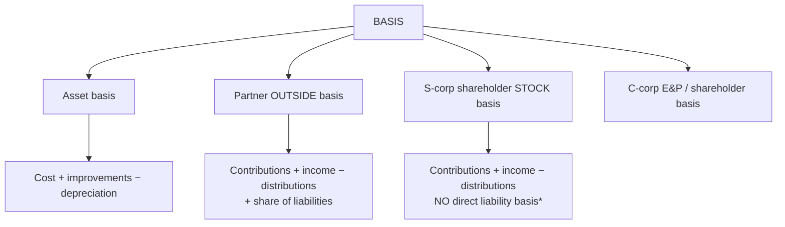
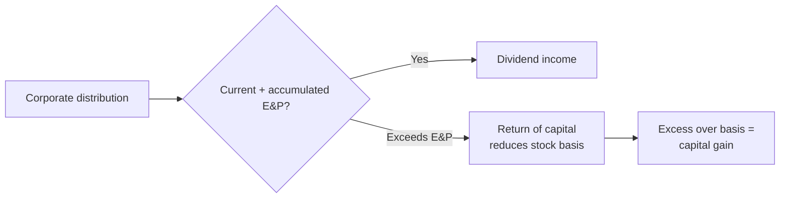
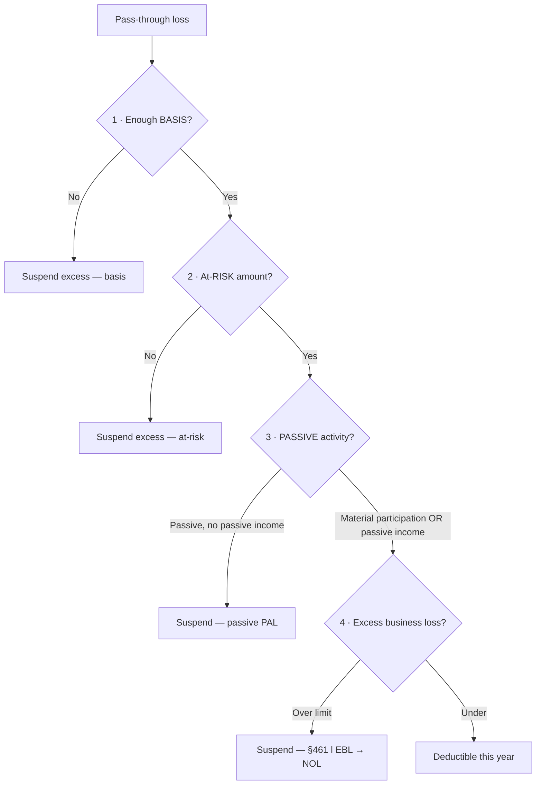
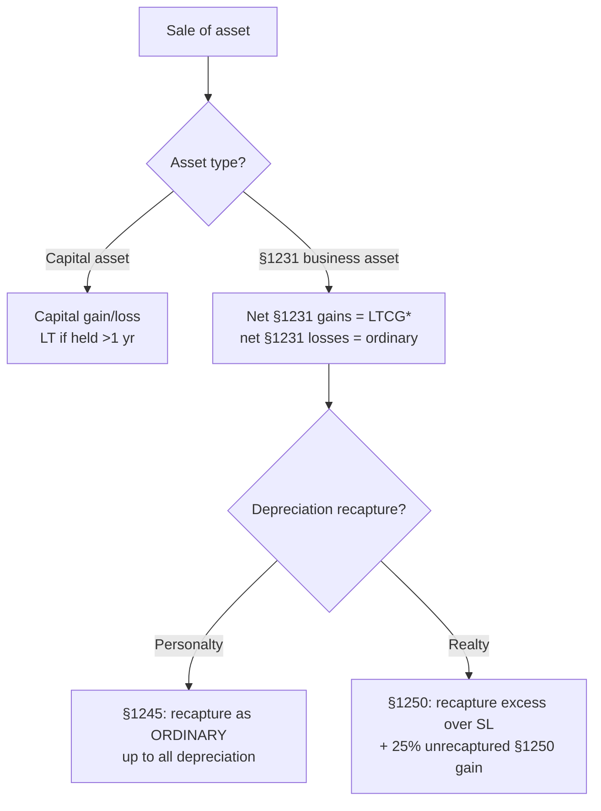
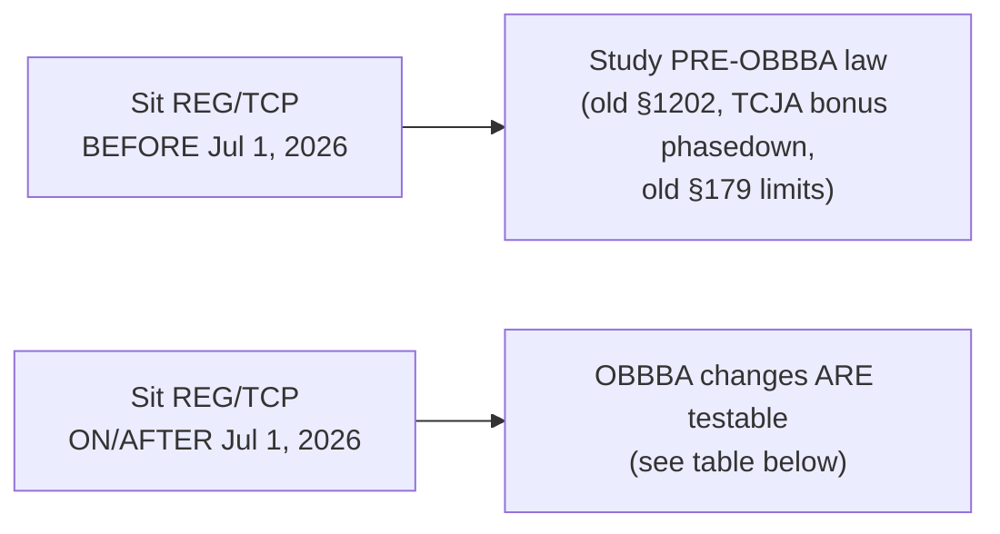

# REG — Deep-Dive Artifacts

Exam-ready reference sheets for REG's highest-yield clusters — above all, **basis**. Builds on
[`../core-REG.md`](../core-REG.md).

> ⚠️ **Tax-law currency matters.** The CPA Exam tests federal tax law as of a published cutoff (generally
> ~6 months after enactment) per testing window. The **One Big Beautiful Bill Act (OBBBA, enacted
> July 4, 2025)** changed several items below. **Confirm which law version is testable in your sit window**
> via the AICPA before relying on specific dollar figures. Concepts are stable; thresholds drift.

**Contents:** 1) Basis master sheet · 2) Three-entity comparison · 3) Loss-limitation ordering · 4)
Property dispositions & character · 5) Business-law rule grid · 6) OBBBA 2025 change log.

---

## 1. Basis master sheet (the most-tested number in REG/TCP)



### Partner outside basis (partnerships/LLCs)
```
Beginning basis
 + capital contributions
 + share of partnership income (ordinary + separately stated)
 + share of tax-exempt income
 + increase in share of partnership liabilities
 − distributions (cash first, then property at basis)
 − share of losses & nondeductible expenses
 − decrease in share of partnership liabilities
 = Ending outside basis  (cannot go below zero)
```
**Key:** partners **do** get basis for their share of **partnership liabilities** (recourse vs. nonrecourse
allocation matters). Distributions reduce basis (cash before property); gain only when cash distribution
exceeds basis.

### S-corp shareholder stock basis
```
Beginning stock basis
 + capital contributions
 + income items (ordinary + separately stated, incl. tax-exempt)
 − distributions (not exceeding basis; then capital gain)
 − nondeductible expenses
 − deductible losses/deductions  (limited to stock + DEBT basis)
 = Ending stock basis
```
**\* Critical difference:** S-corp shareholders get basis only for **direct loans to the corporation (debt
basis)** — **not** for the entity's third-party liabilities (unlike partners). Loss ordering: reduce stock
basis first, then **debt basis**.

### C-corp — E&P & distributions
A distribution is a **dividend** to the extent of **E&P**; then **return of capital** (reduces stock basis);
then **capital gain**.



---

## 2. Three-entity comparison (C corp · S corp · Partnership)

| Feature | **C corporation** | **S corporation** | **Partnership / LLC** |
|---|---|---|---|
| Taxation | **Entity-level** (double tax on dividends) | **Pass-through** | **Pass-through** |
| Tax form | 1120 | 1120-S + K-1 | 1065 + K-1 |
| Owner basis from entity debt | N/A | **Only direct shareholder loans** | **Yes** — share of all liabilities |
| Income character | Retained at corp; dividends to owners | Flows through, **separately stated** items keep character | Flows through, separately stated items keep character |
| Loss pass-through | No (NOL stays at corp) | Yes — limited to **stock + debt** basis | Yes — limited to **outside** basis |
| Distributions | Dividend / ROC / gain (E&P) | Tax-free to extent of basis (AAA) | Tax-free to extent of basis |
| Eligibility limits | None | ≤100 shareholders, one class of stock, U.S. individuals/certain trusts | Flexible |
| Self-employment tax | No (wages only) | No on distributions (reasonable wages required) | **Yes** on general partner ordinary income |
| Special items | DRD, charitable 10% limit, NOL rules | Built-in gains tax, AAA | §704(b)/(c), §754 elections, hot assets §751 |

> **Separately stated items** (both S corp & partnership): capital gains/losses, §1231, charitable
> contributions, §179, interest/dividend income, foreign taxes, etc. — anything that could be taxed
> differently on the owner's return keeps its character on the **K-1**.

---

## 3. Loss-limitation ordering (apply in this exact order)



1. **Basis** (outside/stock basis) — can't deduct below zero.
2. **At-risk** (§465) — amounts economically at risk (nonrecourse generally not at-risk).
3. **Passive activity loss** (§469) — deductible only against passive income unless materially
   participate; suspended losses release on full disposition.
4. **Excess business loss** (§461(l)) — aggregate business losses capped (indexed); excess becomes an NOL
   carryforward. *(OBBBA made §461(l) permanent — verify the current threshold.)*

---

## 4. Property dispositions & character

**Gain/loss = Amount realized − Adjusted basis.** Then characterize:



\* **§1231 lookback:** net §1231 gain is ordinary to the extent of **non-recaptured §1231 losses** in the
prior **5 years**.

| Code section | Applies to | Effect |
|---|---|---|
| **§1231** | Depreciable/real business property held > 1 yr | Net gain → LTCG; net loss → ordinary (best of both) |
| **§1245** | Depreciable **personalty** (equipment) | Recapture **all** prior depreciation as **ordinary** income |
| **§1250** | Depreciable **real** property | Recapture excess over straight-line as ordinary; **unrecaptured §1250 gain** taxed at max **25%** |
| **§1031** | Like-kind **real property** (business/investment) | Defer gain; **boot** triggers recognition; carryover basis |
| **§453** | Installment sales | Recognize gain as **payments received** (not for inventory/recapture) |
| **§1202** | Qualified small business stock | Gain exclusion (see §6 — **OBBBA changed this**) |
| **Related party (§267)** | Sales to related parties | **Losses disallowed**; later sale may reduce gain |

**§1031 boot & basis:** recognized gain = lesser of realized gain or boot received. New basis = old basis +
gain recognized − boot received + boot paid.

---

## 5. Business-law rule grid (Area II — 15–25%)

| Topic | Must-know rules |
|---|---|
| **Contracts** | Offer + acceptance + consideration; **Statute of Frauds** (writing for land, >1 yr, >$500 goods (UCC), suretyship); UCC vs. common law; breach remedies (expectation, reliance, restitution); conditions vs. warranties |
| **Agency** | Actual vs. apparent authority; principal liability; duties (loyalty, care, obedience); termination |
| **Secured transactions (UCC 9)** | **Attachment** (value + rights + security agreement) vs. **perfection** (filing/possession/control); priority rules; **PMSI** super-priority |
| **Debtor-creditor / suretyship** | Surety rights (exoneration, reimbursement, subrogation, contribution); guarantor vs. surety |
| **Bankruptcy** | Ch. **7** (liquidation), **11** (reorganization), **13** (individual repayment); automatic stay; priority of claims; preferential/fraudulent transfers; dischargeable vs. non-dischargeable debts |
| **Worker classification** | Employee vs. independent contractor; payroll-tax consequences |
| **Anti-bribery (FCPA)** | Anti-bribery + books-and-records provisions |
| **Entity formation** | Formation/termination, owner rights/duties, limited liability, fiduciary duties |

**Bankruptcy claim priority (simplified):** secured claims → domestic support → admin expenses → wages
(capped) → employee benefit plans → consumer deposits → taxes → general unsecured.

---

## 6. OBBBA 2025 change log + the **July 1, 2026 testability cutoff**

### ⏱️ The cutoff that decides which law you study (VERIFIED)
The AICPA phases new tax law in on a delay. **OBBBA provisions with 2024/2025 effective dates become
testable on REG and TCP starting the Q3 window — July 1, 2026.**



| If your REG/TCP sit is… | Which tax law applies |
|---|---|
| **Before July 1, 2026** (Q1–Q2 2026) | **Pre-OBBBA** — e.g., §1202 100%-only at 5 yrs / $50M asset cap; TCJA bonus phasedown (40% in 2025); pre-OBBBA §179 |
| **On/after July 1, 2026** (Q3 2026+) | **OBBBA** changes below are testable |
| Provisions effective **2026 or later** | Standard policy: testable the **first quarter beginning 6 months after** the effective date |

> Only **REG and TCP** are affected. FAR, AUD, BAR, ISC are **not** touched by OBBBA.
> **Today is 2026-06-07** → a sit right now is **pre-OBBBA**. Confirm your exact window before memorizing figures.

### OBBBA changes (testable Jul 1, 2026+)

| Item | Change | Note |
|---|---|---|
| **Bonus depreciation** | **100% permanently restored** for qualified property placed in service after **Jan 19, 2025** (reverses TCJA phasedown) | Pre-Jul-2026 exams still test the **TCJA phasedown** |
| **§179 expensing** | Limit raised to **$2.5M**, phase-out threshold **$4M** (2025), inflation-indexed | Dollar figures drift — verify for the testable year |
| **§1202 QSBS** | New **tiered** exclusion: **50% @ 3 yr, 75% @ 4 yr, 100% @ 5 yr**; per-issuer cap → **$15M**; gross-asset limit → **$75M**; applies to stock acquired **after July 4, 2025** ($50M / 5-yr-only / 100% rules remain for older stock) | Major change |
| **§461(l) excess business loss** | Made **permanent** | Verify indexed threshold |

> **Bottom line:** learn the **mechanics** of bonus/§179/§1202 either way; the **version and dollar
> thresholds** depend on whether your sit is before or after the July 1, 2026 cutoff.

---

## Verify-later flags
- [ ] Confirm AICPA testable-law cutoff for your 2026 sit window (OBBBA provisions).
- [ ] Confirm §179 / §461(l) indexed thresholds for the testable year.
- [ ] Confirm §1202 tiered-exclusion exam treatment.
- [ ] Cross-check basis ordering rules vs. current IRC (§704(d), §1366(d), §469, §465).

_Built 2026-06-07 from IRC knowledge + AICPA 2026 blueprint + OBBBA research (thetaxadviser/Grant
Thornton/Plante Moran summaries). Tax thresholds especially require verification._
