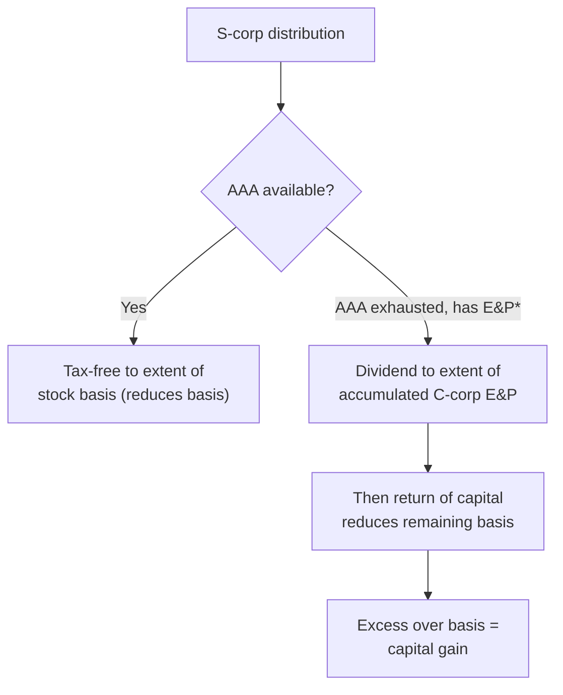
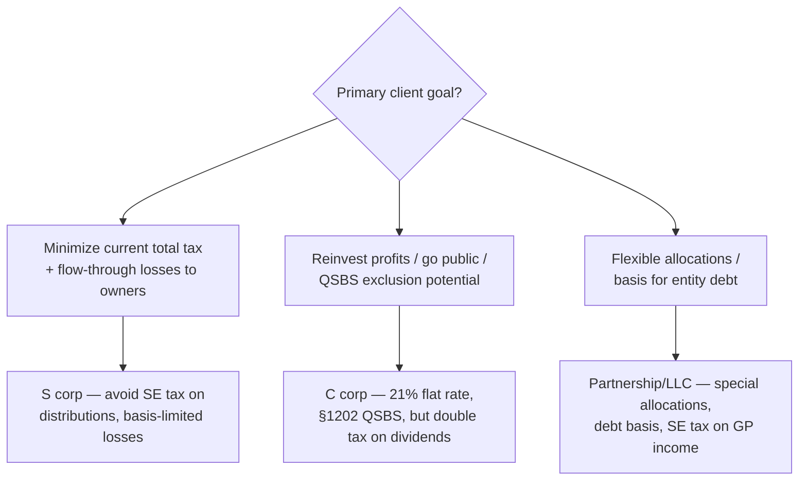
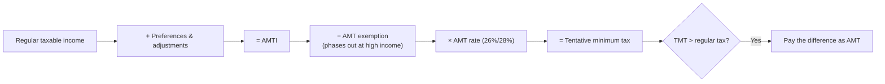
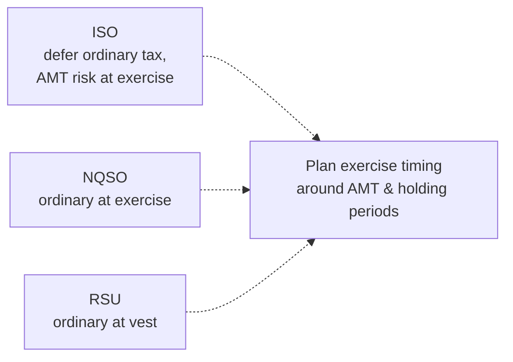
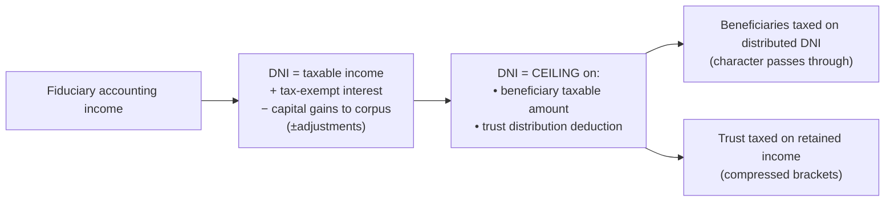

# TCP — Deep-Dive Artifacts (Discipline)

Exam-ready reference sheets for the tax-planning Discipline ("REG, leveled up"). Application-dominant
(55–65%) and planning/owner-consequence heavy. Builds on [`../discipline-TCP.md`](../discipline-TCP.md).

> ⚠️ **Same OBBBA testability cutoff as REG.** OBBBA (2024/2025 provisions) is testable on TCP starting
> **July 1, 2026**. Sit **before** that date → **pre-OBBBA** law. See
> [`REG-deep-dive.md`](REG-deep-dive.md) §6 for the full cutoff table. Confirm your window before
> memorizing §1202 / bonus / §179 figures.

**Contents:** 1) Owner basis & distributions · 2) Entity selection · 3) Property dispositions (planning) ·
4) Individual planning & AMT · 5) Equity compensation · 6) Trusts, DNI, estate & gift.

---

## 1. Owner basis & distribution ordering (the REG carryover, deepened)

### S-corp distribution ordering (with AAA)

\* E&P exists only if the S corp **was previously a C corp** or acquired C-corp E&P. **AAA** (Accumulated
Adjustments Account) tracks post-election undistributed S income.

### Partner outside basis (recap from REG, used for planning)
`Beginning + contributions + income share + liability-share increase − distributions − loss share −
liability-share decrease = ending` (floor at zero). Partners get basis for **all** partnership liabilities;
S-corp shareholders only for **direct loans**.

| | S-corp shareholder | Partner |
|---|---|---|
| Basis from entity debt | **Only direct shareholder loans** (debt basis) | **Share of all** entity liabilities |
| Loss limit | Stock basis **then** debt basis | Outside basis |
| Distribution account | **AAA** | Capital account |

---

## 2. Entity-selection framework (Area III)

| Driver | Favors |
|---|---|
| Flow-through losses to owners early | S corp / partnership |
| Self-employment tax minimization | S corp (reasonable-wage rule) |
| Special/disproportionate allocations | Partnership/LLC |
| Owner basis from entity-level debt | Partnership/LLC |
| Retain & reinvest earnings; QSBS upside | C corp |
| Avoid double taxation on distributions | S corp / partnership |
| Fringe-benefit deductibility for owners | C corp |

---

## 3. Property dispositions — planning lens (Area IV)

Builds on REG's character rules ([`REG-deep-dive.md`](REG-deep-dive.md) §4); TCP adds **timing & strategy**.

| Tool | Planning use | Watch-out |
|---|---|---|
| **§1031 like-kind** (real property) | Defer gain on business/investment real estate | Boot triggers gain; carryover basis; **no** personalty post-TCJA |
| **Installment sale (§453)** | Spread gain over years of collection → smooth brackets | Not for inventory or **depreciation recapture** (recapture taxed in year 1) |
| **§1202 QSBS** | Exclude gain on qualified C-corp stock | **OBBBA tiered rules** post-Jul-2026 (50/75/100% at 3/4/5 yr); confirm version |
| **Involuntary conversion (§1033)** | Defer gain if proceeds reinvested in similar property | Replacement-period limits |
| **Related-party (§267)** | Loss **disallowed**; plan around it | Disallowed loss may offset later gain |
| **Charitable gift of appreciated stock** | Deduct FMV, avoid capital gain | AGI % limits; LTCG property |
| **Opportunity zones / §1031 timing** | Defer/reduce gain | Strict timelines |

**Unrecaptured §1250 gain** (real property depreciation) taxed at max **25%**; **§1245** recapture is fully
ordinary — plan asset mix accordingly.

---

## 4. Individual planning & AMT (Area I — largest area)

**AMT mechanics:**

| AMT preference/adjustment | Effect |
|---|---|
| **ISO bargain element** (exercise, not sold) | **Adds** to AMTI (classic trap) |
| Private-activity bond interest | Adds |
| Depreciation (excess over AMT method) | Adjustment |
| State/local tax deduction | Added back (not deductible for AMT) |

**Other Area I planning:** estimated-tax safe harbors (90% current / 100% prior-year, 110% if high AGI);
passive & at-risk limits; charitable-giving strategy (cash vs. appreciated property, AGI limits);
retirement contributions (traditional vs. Roth, backdoor); HSA; kiddie tax.

---

## 5. Equity compensation — ISO vs. NQSO vs. RSU

| Type | At grant | At exercise | At sale | AMT |
|---|---|---|---|---|
| **ISO** | None | None for regular tax; **bargain element is AMT preference** | If holding met (2 yr grant / 1 yr exercise): all **LTCG**; else disqualifying disposition = ordinary | **Yes** at exercise |
| **NQSO** | None (usually) | **Ordinary income** = FMV − exercise price (W-2) | Capital gain/loss on later appreciation | No |
| **RSU** | None | **Ordinary income** = FMV at **vesting** | Capital gain/loss after vesting | No |

**Planning levers:** ISO holding periods to convert to LTCG; spread NQSO exercises across years; §83(b)
election on restricted stock (tax at grant on low value, start LTCG clock — risk if forfeited).

---

## 6. Trusts, DNI, estate & gift (Area II + I)

### Trust taxation & DNI

- **DNI** caps both the trust's **distribution deduction** and the **beneficiaries' taxable** amount; it
  also preserves **character** (e.g., tax-exempt stays exempt).
- **Simple trust:** must distribute all income currently, no corpus distributions, no charity → taxed to
  beneficiaries. **Complex trust:** may accumulate, distribute corpus, give to charity.
- Trusts hit the **top bracket** at very low income (compressed) → planning favors distributing to
  lower-bracket beneficiaries.

### Estate & gift (unified transfer tax)
| Concept | Key point |
|---|---|
| **Annual gift exclusion** | Per donee, per year (indexed); **gift-splitting** doubles it for married couples |
| **Unified credit / exemption** | One lifetime exemption covers gifts + estate (indexed) |
| **Unlimited marital & charitable deduction** | Transfers to spouse/charity not taxed |
| **Gift tax paid by** | The **donor** |
| **Step-up in basis at death** | Inherited property basis = FMV at death (vs. carryover for gifts) |
| **GST tax** | Generation-skipping transfers (to grandchildren+) — separate tax |
| **Planning vehicles** | A-B (bypass) trusts, GRATs, CRTs, FLPs, ILITs |

> **Gift vs. inherit basis trap:** gifts = **carryover** basis (dual-basis rule for losses); death =
> **stepped-up** basis. Plan which assets to gift vs. hold until death accordingly.

---

## TCP strategy reminders
- Answer as a **planner**: "which option minimizes total tax for this client, and why?"
- **Basis errors cascade** — re-drill S-corp/partner basis before sitting.
- Watch the **ISO→AMT** and **gift→carryover-basis** traps; they're TCP favorites.

## Verify-later flags
- [ ] Confirm **OBBBA testability** for your TCP window (pre/post July 1, 2026).
- [ ] Confirm indexed figures: annual gift exclusion, unified exemption, AMT exemption/phaseout, estimated-tax thresholds.
- [ ] Confirm TCP Area weights (I 30–40 / II 30–40 / III 10–20 / IV 10–20) vs. live 2026 blueprint.

_Built 2026-06-07 from IRC knowledge + AICPA 2026 blueprint structure + TCP topic research (DNI, estate/gift,
AMT, equity comp). Indexed dollar figures require verification for the testable year._
