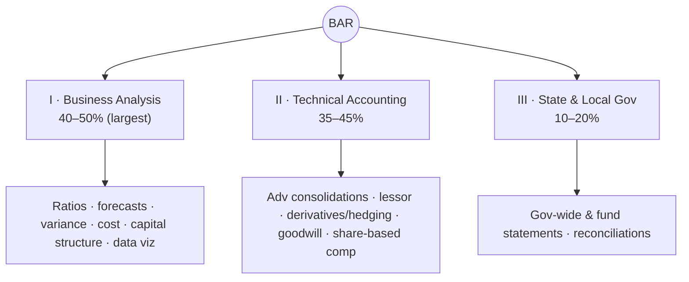
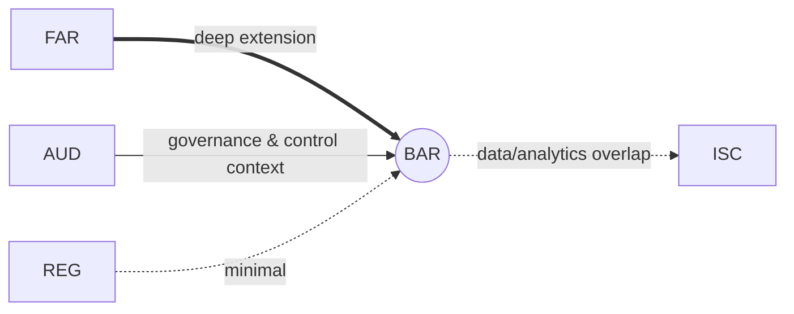

# BAR — Business Analysis & Reporting (Discipline)

> "FAR, leveled up." BAR extends financial reporting into **analysis, FP&A, advanced technical accounting,
> and full governmental accounting.** It is the **broadest** Discipline and historically has the **lowest
> Discipline pass rate** — don't treat it as "advanced FAR leftovers"; study it as its own section.

---

## 1. Snapshot

| Attribute | Detail |
|---|---|
| Status | **Discipline** (choose this *or* ISC *or* TCP) |
| Length / format | 4 hours · **50 MCQ + 7 TBS** · 50% MCQ / 50% TBS |
| Skill emphasis | R&U 10–20 · **Application 45–55** · **Analysis 30–40** (most analysis-heavy section) |
| Governing authorities | **FASB ASC**, **GASB**, SEC; managerial/finance concepts |
| Recent pass rate (Q1 2026, context) | ~**41%** — broadest & lowest among Disciplines |
| Recommended hours | **90–110** (add 15–30 if governmental accounting or finance/analytics is weak) |
| Best-fit candidate | Strong in financial reporting, FP&A, valuation, analytics, or governmental accounting |

---

## 2. Blueprint area breakdown (2026)

### Area I — Business Analysis · **40–50%** (largest)
Financial and managerial analysis, FP&A, and the data behind it.
- **Financial statement analysis** — current/historical, **ratio analysis & benchmarking** (liquidity,
  solvency, profitability, activity), industry comparison
- **Non-GAAP & nonfinancial metrics**; data concepts (data types, governance, quality) & **data visualizations**
- **Cost & managerial accounting** — cost behavior, allocation, variance analysis
- **Budgets, forecasts, projections**; **sensitivity & breakeven** analysis; prospective financial information
- **Capital structure**; cost of capital; **working-capital** management; comparison of investment alternatives
- **Market & economic influences** (only as they connect to forecasting/analysis)

### Area II — Technical Accounting & Reporting · **35–45%**
The advanced FASB topics beyond FAR's core.
- **Revenue** (deeper contracts); **share-based comp**; **R&D**; **software** (internal-use & for-sale)
- **Indefinite-lived intangibles & goodwill** (impairment)
- **Business combinations** & **consolidations** (advanced: intercompany, NCI, step acquisitions)
- **Derivatives & hedge accounting**; **lessor** accounting (the other side of FAR's lessee leases)
- Public-company reporting topics

### Area III — State & Local Governments · **10–20%**
- Full **government-wide** statement formats; **fund** financial statements
- **Reconciliations** between fund and government-wide statements
- GASB recognition/measurement; budgetary reporting

---

## 3. High-yield clusters

1. **Ratio & financial-statement analysis** — compute and **interpret** (analysis, not just calc).
2. **Forecasting / prospective financials** — budgets, projections, sensitivity, breakeven.
3. **Advanced consolidations** — intercompany eliminations, NCI, step acquisitions.
4. **Derivatives & hedge accounting** — fair-value vs. cash-flow hedges (high-difficulty, high-yield).
5. **Governmental** — government-wide ↔ fund reconciliations (the part FAR only introduced).
6. **Cost/managerial & variance analysis** — standard costs, variances, contribution.
7. **Lessor accounting** — sales-type/direct-financing vs. operating.

---

## 4. Connections (how BAR plugs into the web)

- **← FAR (primary):** BAR assumes FAR's mechanics and extends them — consolidations, leases (now lessor),
  revenue (deeper), and **full** governmental accounting. **If FAR was your strongest Core, BAR is the
  efficient Discipline.**
- **↔ ISC/AUD:** data concepts, governance, and analytics overlap with AUD's data-reliability work and
  ISC's data lifecycle.
- **Reused threads:** rev rec, leases, gov/NFP, consolidations, data & analytics — [`../roadmap/01-master-roadmap.md`](../roadmap/01-master-roadmap.md) §4.

---

## 5. Representative TBS types

- **Forecast / budget model** TBS; **sensitivity / breakeven** analysis.
- **Ratio / variance interpretation** (compute *and* explain what it means).
- **Consolidation** entries with intercompany & NCI.
- **Government-wide reconciliation** from fund statements.
- **Acquisition analysis**; **hedge accounting** case.

---

## 6. Common pitfalls & the hard truth

| Pitfall | Hard truth | Fix |
|---|---|---|
| Treating BAR as "advanced FAR leftovers" | BAR mixes FP&A, cost, finance, advanced accounting, **and** government | Study it as a **separate discipline**, budget full hours |
| Calculating ratios but not interpreting | BAR is the most **analysis**-heavy section | Always answer "so what does this number mean?" |
| Skipping derivatives/hedging | High-difficulty but recurring | Build a fair-value vs. cash-flow hedge decision sheet |
| Under-preparing governmental | 10–20% of points, often neglected | Lock the gov-wide ↔ fund reconciliation |

---

## 7. Resources for BAR

- **Official first:** AICPA 2026 BAR Blueprint; **FASB ASC**; **GASB** (`gasb.org`) for governmental depth.
- **Text (if needed):** Hoyle *Advanced Accounting* (consolidations, foreign currency); Granof
  (gov/NFP depth); a managerial/cost text for variance analysis.
- **Real-world:** SEC EDGAR for segment data, non-GAAP reconciliations, hedging disclosures.

---

## 8. Deeper-research TODO

> ✅ **Built:** [`deep-dives/BAR-deep-dive.md`](deep-dives/BAR-deep-dive.md) — ratio dictionary + DuPont,
> cost/variance formulas, breakeven & capital budgeting, advanced consolidations, derivatives & hedge
> accounting, government-wide ↔ fund reconciliation.

- [ ] Pull exact Area I–III topic lists from the 2026 blueprint; map overlap vs. FAR to avoid re-studying.
- [ ] Build a **ratio dictionary** (formula + what it diagnoses + benchmark direction).
- [ ] Build a **hedge accounting** decision sheet (fair-value vs. cash-flow vs. net-investment).
- [ ] Build an **advanced consolidation** template (intercompany, NCI, step acquisition).
- [ ] Build a **gov-wide ↔ fund reconciliation** worked example (extends [`core-FAR.md`](core-FAR.md) gov basics).
- [ ] Collect cost/variance formula sheet (price/quantity/efficiency variances).

_Last researched: 2026-06-07 · Verify weights against the live AICPA 2026 Blueprint._
