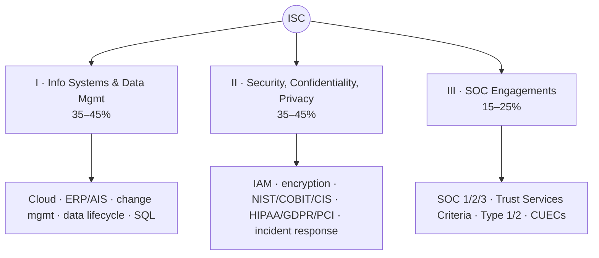
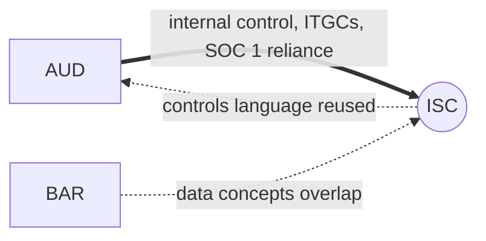

# ISC — Information Systems & Controls (Discipline)

> The IT-audit Discipline: information systems, data management, **security/confidentiality/privacy**, and
> **SOC engagements.** Less computational than BAR/FAR but **heaviest on memorize-and-understand** —
> frameworks, terminology, and how controls operate inside business processes. The natural extension of
> AUD's internal-control content.

---

## 1. Snapshot

| Attribute | Detail |
|---|---|
| Status | **Discipline** (choose this *or* BAR *or* TCP) |
| Length / format | 4 hours · **82 MCQ + 6 TBS** (most MCQs) · **60% MCQ / 40% TBS** (the only 60/40 split) |
| Skill emphasis | **R&U 55–65 · Application 35–45** (no Analysis/Evaluation) — most recall-heavy section |
| Governing authorities | **AICPA SOC / SSAE**, **Trust Services Criteria**, **NIST**, **COBIT**, **CIS**, privacy regs (HIPAA/GDPR/PCI) |
| Recent pass rate (Q1 2026, context) | ~**67%** — among the higher pass rates |
| Recommended hours | **70–90** (add 10–20 if cyber/privacy/framework terms are new) |
| Best-fit candidate | IT audit, SOC, cybersecurity, systems, or data-process backgrounds |

---

## 2. Blueprint area breakdown (2026)

### Area I — Information Systems & Data Management · **35–45%**
- **IT infrastructure** (on-prem, **cloud**), **ERP/AIS**, **blockchain** risk
- **Process mapping**; **change management**; system development / SDLC
- **Data** storage / schema / **data life cycle** (collection → storage → usage → archival/destruction)
- **SQL** & query logic; **data integrity** & quality
- Processing integrity, availability

### Area II — Security, Confidentiality & Privacy · **35–45%**
- **Threats & vulnerabilities**; mitigation; **incident response**
- **Encryption**; **access controls** & identity/access management (IAM); **network security**
- **Frameworks:** **NIST CSF 2.0** & Privacy Framework, **CIS**, **COBIT**
- **Privacy regulations:** **HIPAA, GDPR, PCI-DSS**; confidentiality vs. privacy controls

### Area III — Considerations for SOC Engagements · **15–25%**
- **SOC 1, SOC 2, SOC 3, SOC for Cybersecurity** — purpose & differences
- **Trust Services Criteria** (Security, Availability, Processing Integrity, Confidentiality, Privacy)
- **Type 1 vs. Type 2** reports; **subservice organizations** (carve-out vs. inclusive)
- **CUECs** (complementary user-entity controls); **description criteria**

---

## 3. High-yield clusters

1. **SOC report taxonomy** — SOC 1 vs. 2 vs. 3 vs. Cybersecurity; Type 1 vs. Type 2; who uses each.
2. **Trust Services Criteria** — the 5 categories and what each covers.
3. **Frameworks** — NIST CSF 2.0 functions, COBIT vs. CIS vs. NIST roles.
4. **Access controls / IAM** — authentication, authorization, least privilege, segregation of duties.
5. **Data life cycle & integrity** — the flow from collection to destruction, controls at each stage.
6. **Change management & ITGCs** — the AUD bridge: how IT general controls support application controls.
7. **Privacy regimes** — HIPAA / GDPR / PCI-DSS scope and key obligations.

---

## 4. Connections (how ISC plugs into the web)

- **← AUD (primary):** ISC is the deep version of AUD's **internal control / ITGC / SOC 1** content.
  **If you do IT audit or liked AUD's controls material, ISC is the efficient Discipline (AUD + ISC pair
  well).**
- **↔ BAR:** data types, data governance/quality, and visualization concepts overlap.
- **Reused threads:** internal control/COSO, data & analytics — [`../roadmap/01-master-roadmap.md`](../roadmap/01-master-roadmap.md) §4.

---

## 5. Representative TBS types

- MCQ sets on **frameworks & terminology** (where most of the section's points sit).
- TBS on **control gaps** / control mapping.
- **SOC engagement planning** TBS; choosing the right SOC report.
- **Change-management walkthrough** TBS.
- **Privacy / security deficiency** identification.

---

## 6. Common pitfalls & the hard truth

| Pitfall | Hard truth | Fix |
|---|---|---|
| Memorizing acronyms without understanding systems | ISC tests how controls **operate in business processes & SOC contexts** | Map every term to a **process, risk, and control objective** |
| Under-respecting the volume of terminology | It's the most **recall-heavy** section (R&U 55–65%) | Spaced-repetition flashcards for frameworks/SOC/privacy |
| Confusing SOC report types | The distinctions are heavily tested | Build the SOC matrix early and drill it |
| Ignoring the 60/40 weighting | MCQs carry 60% — more than other sections | Prioritize **MCQ accuracy & speed** |

---

## 7. Resources for ISC

- **Official first:** AICPA 2026 ISC Blueprint; **AICPA SOC** guidance & **Trust Services Criteria**.
- **Frameworks (free, authoritative):** **NIST CSF 2.0** (`nvlpubs.nist.gov`), NIST Privacy Framework,
  **CIS Controls**, **COBIT** overview.
- **Privacy:** plain-language summaries of **HIPAA / GDPR / PCI-DSS** scope.
- **Review course:** strong MCQ bank is especially valuable here given the 60% MCQ weight.

---

## 8. Deeper-research TODO

- [ ] Build the **SOC matrix**: SOC 1/2/3/Cyber × Type 1/2 × user × Trust Services Criteria.
- [ ] Build a **framework comparison**: NIST CSF 2.0 vs. COBIT vs. CIS (purpose, structure, when used).
- [ ] Build a **data life-cycle** diagram with the control at each stage.
- [ ] Make an **IAM / access-control** quick sheet (authN vs. authZ, least privilege, SoD).
- [ ] Build a **privacy-regime** comparison (HIPAA / GDPR / PCI-DSS scope & obligations).
- [ ] Map the **AUD ITGC ↔ ISC** overlap to leverage prior study → [`core-AUD.md`](core-AUD.md).

_Last researched: 2026-06-07 · Verify weights against the live AICPA 2026 Blueprint._
