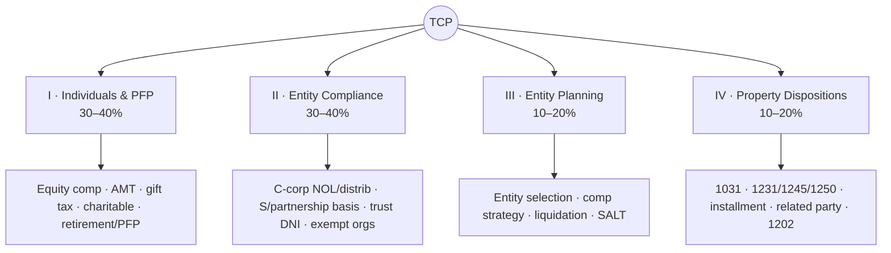
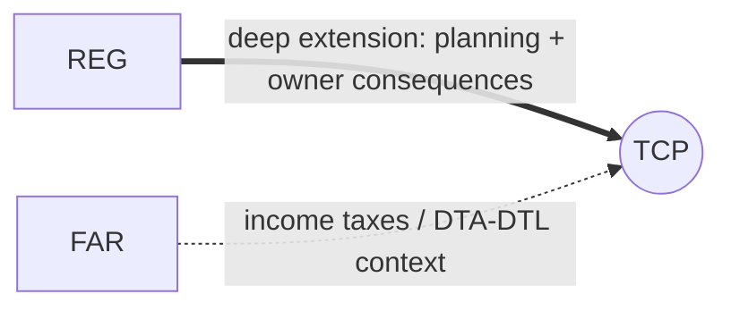

# TCP — Tax Compliance & Planning (Discipline)

> "REG, leveled up." TCP is **planning-heavy, owner-consequence-heavy, and basis-sensitive.** It extends
> REG into advanced individual planning, personal financial planning, sophisticated entity transactions,
> and asset dispositions. Currently the **highest pass rate** of any section — but that reflects a
> self-selecting tax-strong candidate pool, not that it's "easy."

---

## 1. Snapshot

| Attribute | Detail |
|---|---|
| Status | **Discipline** (choose this *or* BAR *or* ISC) |
| Length / format | 4 hours · **68 MCQ + 7 TBS** · 50% MCQ / 50% TBS |
| Skill emphasis | R&U 5–15 · **Application 55–65** (most application-dominant) · Analysis 25–35 |
| Governing authorities | **IRC**, Treasury regs, IRS guidance |
| Recent pass rate (Q1 2026, context) | ~**79%** — highest of all sections |
| Recommended hours | **65–85** (add 15–25 if owner basis, planning, gifts/trusts, or property character are weak) |
| Best-fit candidate | Tax preparers, planners, client-advisory professionals |

---

## 2. Blueprint area breakdown (2026)

### Area I — Tax Compliance & Planning for Individuals & Personal Financial Planning · **30–40%**
- Advanced **individual** income tax computation & compliance
- **Equity compensation** (ISOs/NQSOs/RSUs); **AMT** concepts & computation
- **Estimated tax**; **charitable giving** strategies; **passive & at-risk** limits
- **Gift tax**; retirement & investment planning; **insurance** planning; personal financial planning

### Area II — Entity Tax Compliance · **30–40%**
- **C-corp** NOLs and distributions; **E&P**
- **S-corp & partnership** owner **basis** and distributions
- **Trusts** — DNI and fiduciary taxation; **tax-exempt** organizations
- Non-routine entity transactions & compliance

### Area III — Entity Tax Planning · **10–20%**
- **Entity selection** frameworks (C vs. S vs. partnership trade-offs)
- **Compensation** strategies; entity **formation & liquidation** planning
- **SALT** planning considerations

### Area IV — Property Transactions (Disposition of Assets) · **10–20%**
- **Like-kind exchanges (§1031)**; **involuntary conversions**
- **§1231 / §1245 / §1250** character & recapture; **installment sales**
- **Related-party** transactions & **imputed interest**; **§1202 QSBS** exclusion

---

## 3. High-yield clusters

1. **Owner basis & distributions** — partner/S-corp basis schedules, distribution ordering (the REG carryover).
2. **Property dispositions** — §1031, §1231/1245/1250 recapture, installment sales, §1202.
3. **Individual planning** — equity comp timing, **AMT**, passive/at-risk limits.
4. **Entity selection** — when C vs. S vs. partnership wins, and why.
5. **Gift/estate & trust (DNI)** — fiduciary taxation basics, gifting strategy.
6. **C-corp NOLs & distributions / E&P** — where distributions are dividend vs. return of capital vs. gain.

---

## 4. Connections (how TCP plugs into the web)

- **← REG (primary):** TCP assumes REG's basis machinery, entity flow-through, and property rules, then adds
  **planning** and advanced dispositions. **If you do tax work or liked REG, TCP is the efficient
  Discipline (REG → TCP is the classic tax path).**
- **↔ FAR:** the income-tax provision (DTA/DTL) and book-to-tax concepts give helpful context.
- **Reused threads:** basis, book-to-tax — [`../roadmap/01-master-roadmap.md`](../roadmap/01-master-roadmap.md) §4.

---

## 5. Representative TBS types

- **Basis schedules** (partner/S-corp) and owner-level consequence TBS.
- **Tax-planning comparison** (entity selection, compensation, disposition timing).
- **Asset-disposition** character/recapture computation; **§1031** like-kind boot/basis.
- **Individual/entity planning memo** inside a TBS.
- **C-corp NOL / distribution** ordering case.

---

## 6. Common pitfalls & the hard truth

| Pitfall | Hard truth | Fix |
|---|---|---|
| Treating TCP as "just harder REG" | TCP is **planning-heavy & owner-consequence-heavy**, not more compliance trivia | Practice **planning scenarios**, not just calculations |
| Weak basis carryover from REG | Basis errors cascade through distributions & dispositions | Re-drill **basis ordering** before TCP |
| Ignoring trusts/gifts | Smaller weight but very testable | Lock **DNI** and gift-tax fundamentals |
| Memorizing without planning logic | Application is 55–65% — it's about choosing the better outcome | Frame answers as "which option minimizes tax & why" |

---

## 7. Resources for TCP

- **Official first:** AICPA 2026 TCP Blueprint; **IRS.gov** (forms, instructions, publications).
- **Text (if needed):** *South-Western Federal Taxation* (Individual, Corporations/Entities, comprehensive).
- **Practice:** review-course TBS bank focused on basis, dispositions, and planning comparisons.

---

## 8. Deeper-research TODO

> ✅ **Built:** [`deep-dives/TCP-deep-dive.md`](deep-dives/TCP-deep-dive.md) — owner basis & AAA, entity
> selection, property-disposition planning, AMT flow, equity comp (ISO/NQSO/RSU), trusts/DNI/estate/gift,
> plus the **OBBBA July 1, 2026 testability cutoff**.

- [ ] Build advanced **basis & distribution** templates (partner outside basis, S-corp AAA/stock basis).
- [ ] Build a **property-disposition** map: §1031 · §1231/1245/1250 · installment · §1202 · related-party.
- [ ] Build an **entity-selection decision** framework (C/S/partnership trade-offs by goal).
- [ ] Make an **AMT** computation flow and an **equity-comp** timing sheet (ISO/NQSO/RSU).
- [ ] Build a **trust DNI** & gift-tax quick reference.
- [ ] Map REG→TCP carryover to reuse prior study → [`core-REG.md`](core-REG.md).

_Last researched: 2026-06-07 · Verify weights against the live AICPA 2026 Blueprint._
