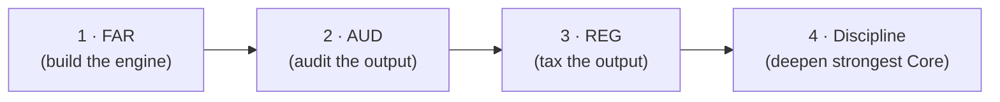
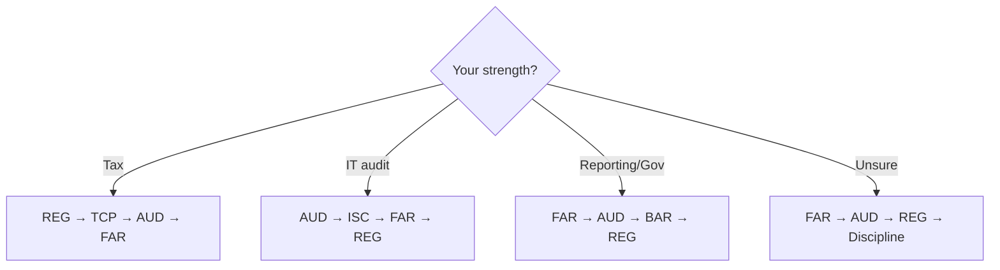
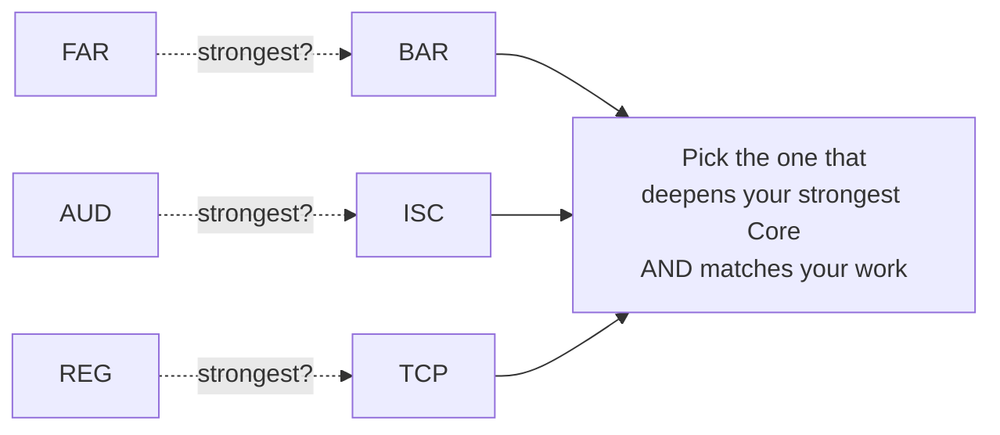
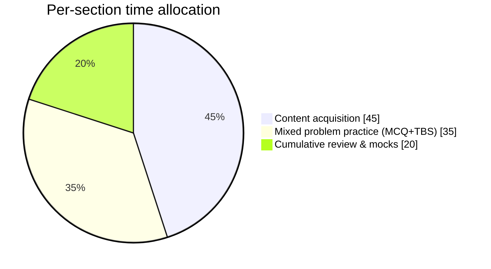

# Study Sequence, Discipline Choice & Hour Targets

How to decide **what order** to sit, **which Discipline** to choose, and **how many hours** to budget.
Sequencing is administratively free (any order allowed) but **not** equally efficient.

---

## 1. The default sequence (most candidates)

**FAR → AUD → REG → Discipline.** Why this is the strongest default:

- **Follows the dependency arrows:** FAR's statement & transaction mechanics support AUD and BAR; AUD
  reinforces controls/evidence/reporting; REG is easier once accounting is automatic.
- **Front-loads the hardest Core:** FAR is broadest and has the lowest Core pass rate — take it while
  motivation and stamina are highest, and while you have the most credit-window runway.
- **Discipline last** lets you pick based on which Core you actually felt strongest in, and lines up with
  the **Jan/Apr/Jul/Oct** Discipline windows.

> This is an analytical recommendation, **not** an official AICPA rule.

---

## 2. Specialist alternative sequences

| Your background | Suggested sequence | Logic |
|---|---|---|
| **Tax** (prep/planning/advisory) | **REG → TCP → AUD → FAR** | Ride tax momentum: REG then its deep extension TCP back-to-back. |
| **IT audit / SOC / cyber** | **AUD → ISC → FAR → REG** | AUD's controls content flows straight into ISC. |
| **Financial reporting / FP&A / governmental** | **FAR → AUD → BAR → REG** | FAR then its deep extension BAR; REG last. |
| **General / unsure** | **FAR → AUD → REG → Discipline** | The default; decide the Discipline after seeing your Core strengths. |

---

## 3. Choosing your Discipline

The AICPA's own guidance: **pick the Discipline aligned with your education, experience, and interests.**
Pass rates inform time budgeting; they should **not** override fit.

| Discipline | Extends | Best for | Recent pass-rate context (Q1 2026) | Watch-out |
|---|---|---|---|---|
| **BAR** | FAR | Reporting, FP&A, valuation, analytics, governmental | ~**41%** (broadest, lowest) | Broad; budget full hours; analysis-heavy |
| **ISC** | AUD | IT audit, SOC, cyber, systems, data | ~**67%** | Most terminology/recall; 60/40 MCQ weight |
| **TCP** | REG | Tax prep, planning, advisory | ~**79%** (highest) | High rate reflects tax-strong pool, not "easy" |

**Decision rule:** *Discipline = (deepens your strongest Core) ∩ (matches your work/interests).* If those
point to different sections, weight **fit and career relevance** over pass-rate.

---

## 4. Hour targets (recommended, not official)

Total planning range: **~380–430 hours** for the whole exam (ThisWayToCPA reports candidates average
~350–450). Add time if you've been out of school, work full-time, or have Red foundations.

| Section | Recommended hours | Add more when… |
|---|---|---|
| **FAR** | **130–150** | JEs, leases, deferred taxes, or NFP/gov basics are weak (+20–40) |
| **AUD** | **90–110** | You've never worked in audit / struggle with engagement & report distinctions (+15–25) |
| **REG** | **90–110** | Basis, entity taxation, or business law are weak (+15–25) |
| **BAR** | **90–110** | Governmental accounting or finance/analytics is weak (+15–30) |
| **ISC** | **70–90** | Cyber/privacy/framework terms are new (+10–20) |
| **TCP** | **65–85** | Owner basis, planning, gifts/trusts, or property character are weak (+15–25) |

**Total (3 Cores + 1 Discipline):**

| If your Discipline is… | Core hours (FAR+AUD+REG) | + Discipline | Total range |
|---|---|---|---|
| BAR | 310–370 | 90–110 | **400–480** |
| ISC | 310–370 | 70–90 | **380–460** |
| TCP | 310–370 | 65–85 | **375–455** |

---

## 5. The 45 / 35 / 20 time split (per section)

Within each section's hours, a durable default allocation:

- **45% content acquisition** — lectures, blueprint reading, condensed notes.
- **35% mixed problem practice** — MCQs and **TBSs** under increasingly realistic conditions.
- **20% cumulative review & mocks** — spaced retrieval + at least two full-length mocks.

**The failure mode to avoid:** spending most of your calendar "still learning notes." If you do, retrieval
and TBS stamina will be too shallow on exam day. Get into mixed practice early.

---

## 6. Sequencing constraints to respect

- **Discipline windows:** Jan / Apr / Jul / Oct (first month of each quarter) in 2026 — back-plan to hit one.
- **Credit window:** verify your state's 18- vs. 30-month rule; don't start the clock with a section you're
  not ready to follow up on. See [`../roadmap/02-exam-architecture.md`](../roadmap/02-exam-architecture.md) §6.
- **Score release:** check published dates so retakes don't stall your sequence.

Next: pick a calendar in [`02-phased-plans.md`](02-phased-plans.md).
