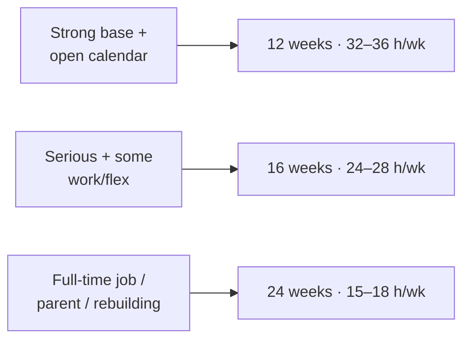
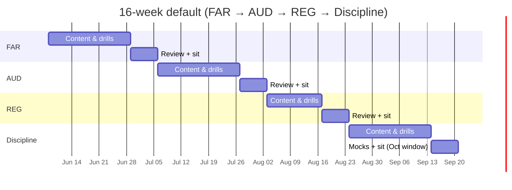

# Phased Plans — 12 / 16 / 24 Weeks

Three calendars for getting through **all four sections**, assuming one current Discipline (not BEC) plus a
primary review course and official AICPA materials. Pick by how much time per week you can sustain.

> These are synthesized recommendations built around blueprint content and exam design — **not** an official
> AICPA schedule. They cover the **full exam (4 sections)**; per-section pacing follows the 45/35/20 split
> from [`01-sequence-and-hours.md`](01-sequence-and-hours.md).

---

## 1. Pick your plan

| Plan | Weekly target | Daily (6 days/wk) | Who it fits | Bottom line |
|---|---|---|---|---|
| **12 weeks** | 32–36 hrs | ~5–6 hrs | Full-time summer study; between graduation & start date; short leave | Aggressive — works only if your accounting base is already strong |
| **16 weeks** | 24–28 hrs | ~4–4.5 hrs | Serious candidates with part-time work or flexible schedules | **Best balance** of pace, retention, burnout control |
| **24 weeks** | 15–18 hrs | ~2.5–3 hrs | Full-time workers, parents, candidates rebuilding fundamentals | Most sustainable; lowest long-term-retention risk |

All three assume the default sequence **FAR → AUD → REG → Discipline** (swap in a specialist sequence from
[`01-sequence-and-hours.md`](01-sequence-and-hours.md) without changing the rhythm).

---

## 2. The 16-week default plan (week-by-week)

This is the recommended backbone. Example start week of **June 8, 2026**, Discipline scheduled last to land
in the **October 2026** Discipline window.

| Week | Milestone |
|---|---|
| 1 | **FAR** Area I — for-profit statements, cash flows, equity, notes, ratios |
| 2 | **FAR** Area I NFP/government basics + Area II cash, receivables, inventory |
| 3 | **FAR** Area II — PP&E, investments, intangibles, liabilities, equity |
| 4 | **FAR** Area III — transactions; cumulative review; **half mock**; weak-area repair |
| 5 | **Sit FAR.** Begin **AUD** Area I — ethics, engagement acceptance, documentation, reporting frames |
| 6 | **AUD** Area II — planning, risk, controls, IT, materiality, fraud |
| 7 | **AUD** Area III — evidence, data analytics, sampling, confirmations, special topics |
| 8 | **AUD** Area IV — reporting; cumulative review; **sit AUD** |
| 9 | **REG** Area I — ethics & tax procedures; Area II — business law |
| 10 | **REG** Area III — property; Area IV — individual taxation |
| 11 | **REG** Area V — entity taxation & return review; cumulative review; **sit REG** |
| 12 | **Discipline** Area I |
| 13 | **Discipline** Area II |
| 14 | **Discipline** Area III (and Area IV for TCP) |
| 15 | Full mixed review + **first full mock** |
| 16 | **Second full mock**, targeted remediation, **sit Discipline** |

---

## 3. The 12-week plan (compressed)

Same sequence and milestone logic, but **compress each Core by ~1 week** and accept an intensive,
unforgiving schedule. Suggested shape:

| Block | Weeks | Focus |
|---|---|---|
| FAR | 1–3.5 | Areas I–III + half mock; **sit FAR** ~end of wk 3 |
| AUD | 3.5–6 | Areas I–IV; **sit AUD** ~wk 6 |
| REG | 6–8.5 | Areas I–V; **sit REG** ~wk 8–9 |
| Discipline | 8.5–12 | Areas + 2 mocks; **sit Discipline** ~wk 12 |

Only attempt this if your foundation is **all Green** (see [`../foundations/00-prerequisites.md`](../foundations/00-prerequisites.md)).

---

## 4. The 24-week plan (sustainable)

Split **each section** into three phases with spaced review and a lighter week after each sit:

| Section | Approx. weeks |
|---|---|
| FAR | 1–7 (content → mixed → review → sit → light) |
| AUD | 8–12 |
| REG | 13–17 |
| Discipline | 18–24 (extra mock time) |

Best choice for full-time workers; the spaced review materially improves long-term retention and lowers
re-take risk.

---

## 5. Plan-agnostic rules

- **Sit shortly after finishing a section** — don't let a passed-readiness section go stale.
- **Bank a "sit buffer"** after each section's mock for scheduling/Prometric reality.
- **Protect one rest day** (or near-rest) per week to prevent burnout.
- **Re-plan after every score release** — adjust the next block to your Candidate Performance Report.
- **Keep the Discipline last** unless a specialist sequence + the Jan/Apr/Jul/Oct windows say otherwise.

Daily/weekly mechanics → [`03-weekly-template.md`](03-weekly-template.md). Readiness gates →
[`04-assessment-remediation.md`](04-assessment-remediation.md).
