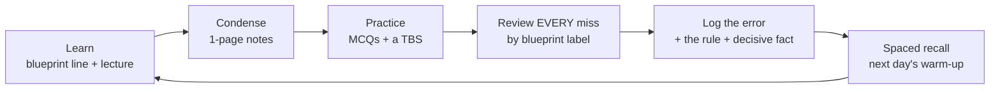

# Weekly & Daily Study Template

A repeatable week you can drop into any section and any plan length. Tuned to the 16-week pace
(~24–26 hrs/week); scale the daily targets up for 12-week or down for 24-week.

---

## 1. Sample week (mid-FAR phase, ~24–26 hrs)

| Day | Time | Focus |
|---|---|---|
| **Mon** | 4.0 hrs | Read blueprint lines for the current topic; watch the lecture; make **condensed notes**; **30 MCQs** |
| **Tue** | 4.0 hrs | **Journal-entry drills & rollforwards**; **2 short TBSs**; update the **error log** |
| **Wed** | 4.5 hrs | New topic block; **35 timed MCQs**; review **every miss by blueprint label** |
| **Thu** | 4.0 hrs | **Mixed cumulative set** from prior topics; **2 medium TBSs**; rework weak calculations |
| **Fri** | 4.0 hrs | **Statement-construction / reconciliation** work; 30 MCQs; formula & concept recall |
| **Sat** | 5.0 hrs | One **90-minute cumulative progress test**, then deep review; rewrite weak-topic notes |
| **Sun** | 0–1.5 hrs | Rest, or light flash review only |

> Adapt the focus to the section: REG/TCP swap "journal entries & rollforwards" for **basis schedules &
> return prep**; AUD/ISC swap for **engagement/report decision drills & control mapping**; BAR for
> **ratio/variance/forecast modeling**.

---

## 2. The daily loop (any section)

**Non-negotiables each day:**
- Tie every study block to a **specific blueprint line** (not a vague topic).
- Review **every** missed question and write **why** — the rule and the decisive fact — in your error log.
- Do at least one **TBS-style** task most days; don't let TBS practice pile up for the end.

---

## 3. The error log (your highest-ROI artifact)

A single running document. One row per miss:

| Date | Section/Area (blueprint label) | Question topic | Why I missed (rule + decisive fact) | Fix / re-drill date |
|---|---|---|---|---|
| | | | | |

- **Categorize the miss:** content hole · misread fact · timing · careless · changed-right-to-wrong.
- **Re-drill** logged items on a spaced schedule (next day, +3 days, +1 week).
- Patterns in this log *are* your remediation plan — they map directly to the failure modes in
  [`04-assessment-remediation.md`](04-assessment-remediation.md).

---

## 4. MCQ vs. TBS discipline

- **MCQs build recognition & speed.** Always do a chunk **timed** by mid-section. Target ~**1.25–1.5
  min/MCQ** average so you bank time for TBSs.
- **TBSs build document fluency & stamina.** They're where memorizers break down. Start them in week 1 of
  each section, not the final week. Practice with **real documents** (SEC EDGAR filings for FAR/BAR; the
  AICPA retired FAR TBS; IRS forms for REG/TCP).
- **Mixed sets** (multiple topics interleaved) beat blocked practice for retention and mimic the real exam.

---

## 5. Weekly close-out (every Saturday/Sunday)

- [ ] Did I hit my **blueprint coverage** target for the week?
- [ ] Is my **error log** reviewed and re-drilled?
- [ ] Are my **MCQ %** and **TBS completion time** trending toward the stage targets?
- [ ] What's the **single weakest topic** this week, and what's the plan for it next week?
- [ ] Re-confirm next week's blueprint lines and any **scheduling** action (NTS, Prometric, score release).

Readiness gates and "what to do if you fail" → [`04-assessment-remediation.md`](04-assessment-remediation.md).
