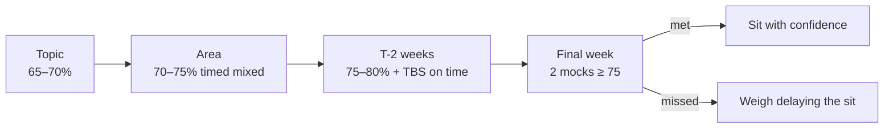
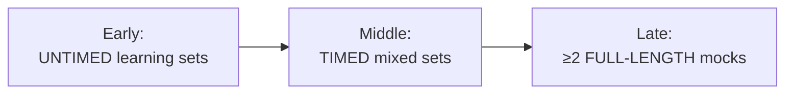
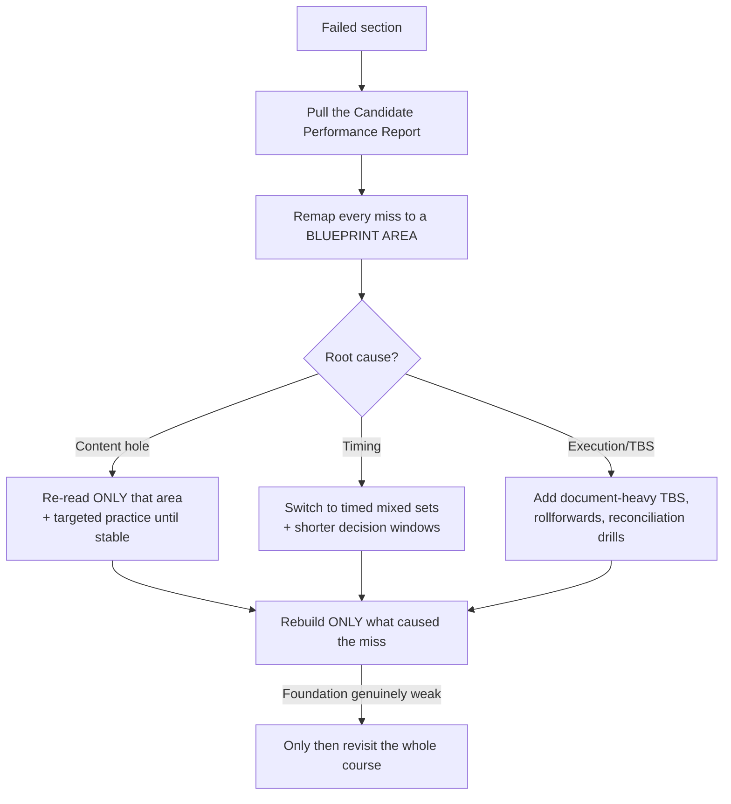

# Assessment & Remediation

How to know you're ready, and exactly what to do when you're not. The exam scores 0–99 with **75** to pass;
scores are **not** percent-correct and **not** curved. Your assessment process must be **blueprint-driven**,
never "I feel okay about this."

---

## 1. Readiness targets by stage (recommended, not official cutoffs)

| Stage | Target | If you miss it |
|---|---|---|
| **End of each topic** | **65–70%** correct **with understanding of every miss** | Re-teach the topic immediately — do **not** just "move on" |
| **End of each blueprint area** | **70–75%** on timed **mixed** sets | Rebuild notes, then do **60–90** cumulative mixed questions from that area |
| **Two weeks before exam** | **75–80%** on mixed timed sets; **TBS completed on time** | Shift the week to remediation; **stop adding new fringe material** |
| **Final week** | **Two full mocks ≥ 75**, or **one ≥ 80 + one ≥ 75** | If below target, **consider delaying the sit** if rescheduling costs less than a likely fail |

---

## 2. The assessment arc across a section

- **Early — untimed learning sets:** build understanding; accuracy over speed.
- **Middle — timed mixed sets:** interleave topics; add the clock; this is where readiness really forms.
- **Late — full-length mocks:** at least **two** before sitting. The **AICPA sample test** is for *software
  familiarity* — it is explicitly **not** a readiness score.

---

## 3. Reading the Candidate Performance Report (if you fail)

A failing score comes with a report rating you **Weaker / Comparable / Stronger** by **content area** and
**item type (MCQ vs. TBS)**. Use it mechanically:

**Do not restart the entire course** unless your foundation is genuinely weak — that's usually wasted motion.

---

## 4. Failure-mode → fix table

| Symptom | What it usually means | Fix |
|---|---|---|
| **High MCQ, low TBS** | You know definitions but can't work from documents/schedules | Add document-heavy TBS work, rollforwards, reconciliation drills |
| **Strong accuracy, poor timing** | You know content; retrieval is too slow | Switch earlier to **timed mixed** sets; shorten decision windows |
| **Repeated misses in one area** | Content hole, not bad luck | Re-read **only** that blueprint area, then targeted practice until stable |
| **High first-pass, weak after a week** | Cramming without spaced review | Add **cumulative mixed review twice weekly** |
| **Changing answers into wrong ones** | Low confidence, shallow rule anchoring | Force yourself to **state the rule + decisive fact** before changing an answer |

---

## 5. Section-specific readiness flags

| Section | "You're ready" looks like… |
|---|---|
| **FAR** | You build statements from a trial balance and roll forward accounts **without** hesitation |
| **AUD** | You **label the engagement** (issuer/nonissuer, audit/review, authority) before every answer |
| **REG** | You produce **basis schedules** and trace flow-through to the owner's return fluently |
| **BAR** | You **interpret** (not just compute) ratios/variances and handle gov-wide↔fund reconciliations |
| **ISC** | You can place any term into a **process/risk/control** and pick the right SOC report cold |
| **TCP** | You choose the **better-tax-outcome option** and explain why (planning, not just compliance) |

---

## 6. The pre-sit go/no-go checklist

- [ ] Two full-length mocks at/above target (§1)
- [ ] TBSs completed **within time** in the mocks
- [ ] Error log shows the last two weeks were **remediation**, not new fringe content
- [ ] No blueprint area still rated "weak" in my own tracking
- [ ] Logistics confirmed: NTS valid, Prometric booked, ID ready, score-release date known
- [ ] Rescheduling cost vs. likely-fail cost weighed honestly

If most boxes are unchecked two weeks out, **delaying is often the cheaper decision** than burning a fail.

---

## 7. After you pass a section

- Log the date and **start the next block within a few days** — momentum compounds.
- Re-confirm your **credit window** math with the new clock (see
  [`../roadmap/02-exam-architecture.md`](../roadmap/02-exam-architecture.md) §6).
- Briefly note what study tactics worked so you can reuse them on the next section.
